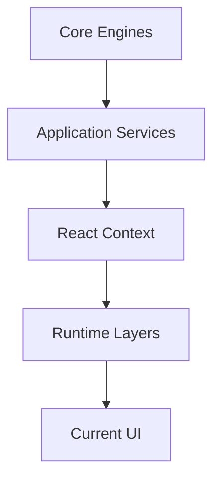

# Start New HicoPilot Session

## Purpose

This document is the bootstrap checklist for every AI development session on HicoPilot.

## Project Identity

| Field | Value |
| --- | --- |
| Product | HicoPilot |
| Type | Business Operating System for SMEs |
| Current Stage | Pre-Alpha |
| Repository | Next.js, TypeScript, Prisma, Tailwind CSS |

## Vision

HicoPilot helps small and medium businesses run daily operations from one intelligent, secure and modern platform.

## Product Philosophy

HicoPilot is not a traditional ERP. It should feel like an executive operating system that helps users understand what happened, what matters now and what to do next.

## Architecture

Current dependency direction:



## Core Engines

Read `src/core/` before changing platform behavior.

Implemented foundations:

- Registry
- Search
- Commands
- Notifications
- Activity
- Favorites
- Recent Items
- Preferences
- Widgets
- Audit

## Application Services

Read `src/services/` before changing orchestration.

Services coordinate Core Engines. UI should not call multiple engines directly when a service already exists.

## Current Status

Read `docs/02_PROJECT_STATUS.md` before starting. It describes the active sprint, current risks and validation health.

## Platform Architecture

Read `docs/05_PLATFORM_ARCHITECTURE.md` before starting any platform sprint or business-module sprint. It is the authoritative architecture constitution for module registration, activation, Editions, navigation, routes, Command Center, Dashboard contributions, persistence boundaries and import safety.

## Completed Sprints

Recent completed platform sprints:

- SPR-201 — Navigation Service Integration
- SPR-202 — Universal Search Service Integration
- SPR-203 — Command Palette Integration
- SPR-204 — Workspace Service Integration
- SPR-205 — Workspace Context Foundation
- SPR-206 — Dashboard Integration Foundation
- SPR-207 — Widget Runtime Foundation

## Current Sprint

The current sprint is listed in `docs/02_PROJECT_STATUS.md`.

## Roadmap

Read `docs/04_ROADMAP.md` for official milestone direction.

## Golden Rules

- Do not rewrite working modules.
- Do not change UI unless the sprint explicitly asks for UI work.
- Do not modify Prisma or database schema unless explicitly required.
- Do not duplicate module metadata outside the Core Registry.
- Keep business logic in services.
- Keep Context free of business logic.
- Let Runtime consume Context.
- Let UI consume Runtime.
- Maintain backward compatibility.

## Validation Rules

Before closing a task:

```bash
npm run typecheck
npm run build
```

Known current build note: `src/components/pdf-preview.tsx` reports an existing `next/image` warning.

## Instructions for AI Assistants

1. Read this file first.
2. Read the Engineering Charter.
3. Inspect the repository before editing.
4. Identify protected areas.
5. Make the smallest safe change.
6. Validate.
7. Report files changed, risks and recommended next step.
