# HicoPilot Architecture

## Overview

HicoPilot is a Next.js application evolving into a platform-based business operating system. The current implementation contains business modules, a Prisma schema, Core Engines, Platform Capability Registry, Manifest System, Module Loader, Application Services, PermissionService, Permission Enforcement, Plugin Runtime, Platform Event Runtime, Notification Event Subscriber, Activity Event Subscriber, Audit Event Subscriber, Workspace Context, Preferences Runtime, Widget Runtime and lightweight runtime validation.

## Technology Stack

| Area | Current Technology |
| --- | --- |
| Framework | Next.js 15 |
| Language | TypeScript |
| UI | React 19, Tailwind CSS, lucide-react, Recharts |
| Database Schema | Prisma with PostgreSQL datasource |
| Documents | jsPDF and PDF React templates |
| Spreadsheet Support | xlsx |
| Validation | TypeScript, Next build, ESLint through Next build, runtime architecture validation |

## Layer Diagram

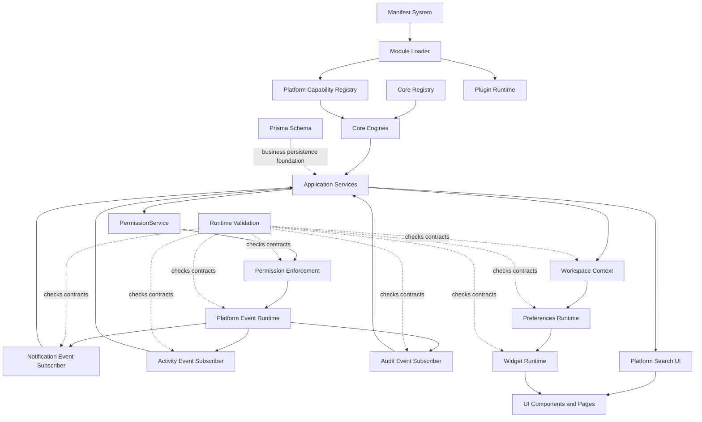

## Dependency Rules

| Layer | May Depend On | Must Not Depend On |
| --- | --- | --- |
| Core Engines | Core types and constants | React UI, pages, providers |
| Application Services | Core Engines | React components |
| Platform UI | Services, Core types | Core implementation ownership, business persistence |
| Context | Services | Business logic, Prisma |
| Runtime | Context, types | Database, Prisma, route handlers |
| UI | Runtime, Context, Services when necessary | Core internals when a service exists |

## Layer Responsibilities

### Core Engines

Located in `src/core/`. They provide static/in-memory foundations for registry, capabilities, manifests, module loading, search, commands, notifications, activity, favorites, recent items, preferences, widgets and audit.

### Manifest System

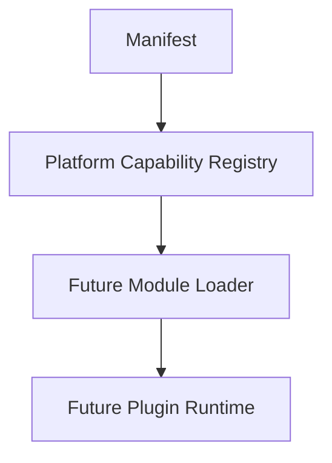

Located in `src/core/manifests/`. The Manifest System defines immutable installable component contracts. It describes identity, capabilities, permissions, dependencies, compatibility, versioning, workspace awareness, entry metadata and validation results. It does not load plugins, install modules, publish packages or register marketplace entries.

### Module Loader

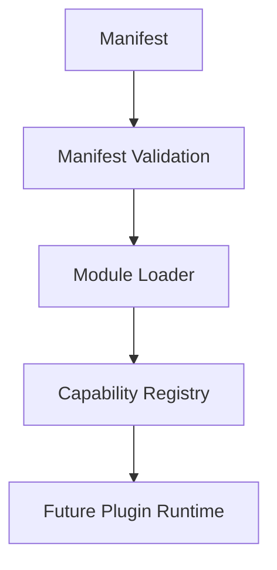

Located in `src/core/module-loader/`. The Module Loader prepares installable components by validating manifests, checking compatibility and dependencies, registering declared capabilities and returning immutable module descriptors. It does not execute modules, perform dynamic imports, install packages or implement Plugin Runtime behavior.

### Plugin Runtime

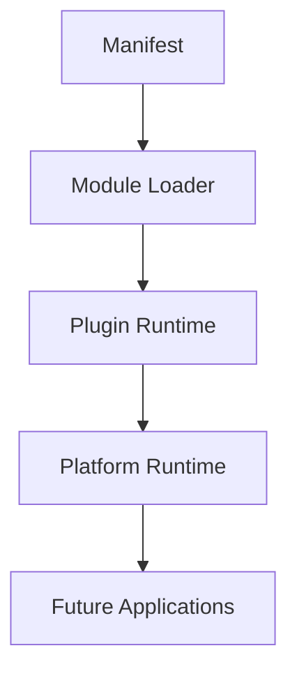

Located in `src/runtime/plugins/`. Plugin Runtime hosts prepared `ModuleDescriptor` objects, tracks lifecycle state and exposes registration, enable, disable, lookup, listing and removal APIs. It prepares future permission integration but does not execute plugin code, load remote modules, perform dynamic imports, install marketplace packages or implement a Plugin SDK.

### Platform Capability Registry

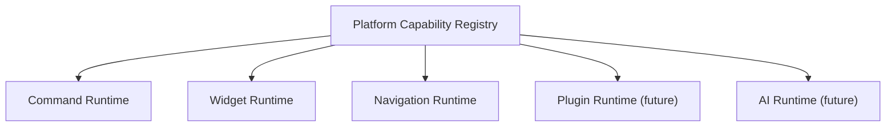

Located in `src/core/capabilities/`. The registry defines generic executable capability contracts for applications, commands, widgets, navigation, services, runtimes, plugins, AI skills, AI agents, workflow actions and API endpoints. It is framework-independent, rejects duplicate ids, returns deterministic lists and keeps capability metadata immutable.

### Application Services

Located in `src/services/`. They orchestrate Core Engines and expose typed APIs for navigation, search, commands, notifications, activity, favorites, recent items, widgets, preferences, audit, permissions, workspace and session.

### Platform Search UI

Located in `src/platform/search/`. It owns the React-specific universal search provider, dialog and hook. It consumes Core Search services and types, while `src/core/search/` remains framework-agnostic and contains only pure TypeScript search foundation code.

### Permission Enforcement

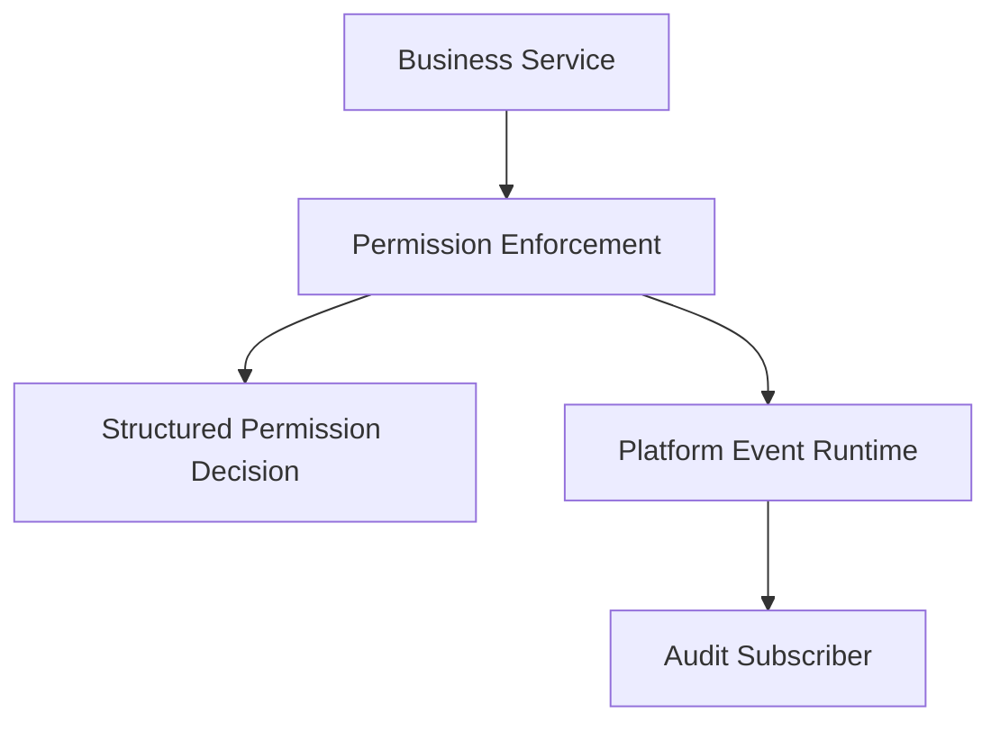

Located in `src/runtime/permissions/`. Permission Enforcement is framework-independent and returns immutable structured authorization decisions. It prepares the future shared gate for commands, widgets, navigation, plugins, workflow actions, AI skills, AI agents and APIs. It currently reuses the static RBAC foundation and does not modify authentication, users, database schema or UI behavior.

`src/services/permissions/PermissionService.ts` is the application-facing orchestrator for this runtime foundation. Widget Runtime consumes it to expose per-widget permission decisions, and CommandService consumes it before command execution. This integration does not yet filter navigation or redesign any UI.

### Platform Event Runtime

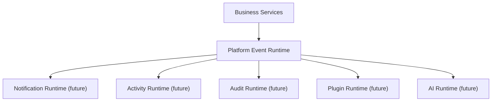

Located in `src/runtime/platform-events/`. The runtime is synchronous, in-memory and framework-agnostic. It provides `emit`, `subscribe`, `unsubscribe`, `once` and `clearSubscriptions` without implementing notification, activity, audit, plugin or AI behavior.

### Notification Event Subscriber

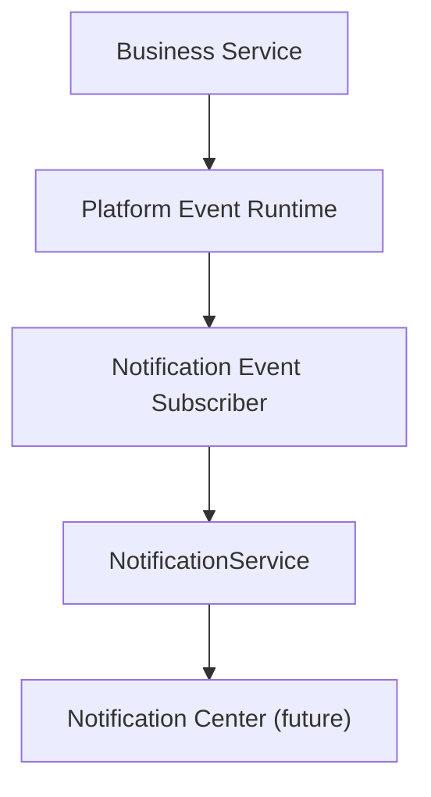

Located in `src/runtime/notifications/`. The subscriber listens to Platform Events, maps supported generic event categories to notification requests and delegates creation to `NotificationService`. It does not render UI, own business logic, persist data or know which service emitted the event.

### Activity Event Subscriber

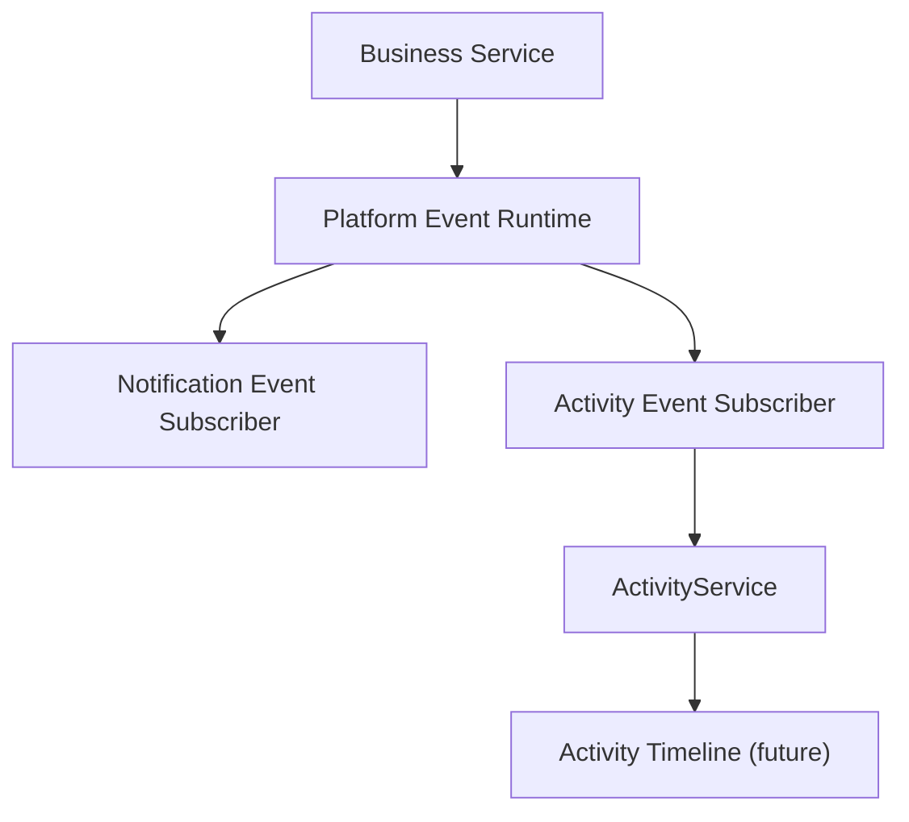

Located in `src/runtime/activity/`. The subscriber listens to Platform Events, maps supported generic event categories to activity records and delegates persistence to `ActivityService`. It is the operational memory layer for future timeline, analytics, workflow, executive dashboard and AI context features.

### Audit Event Subscriber

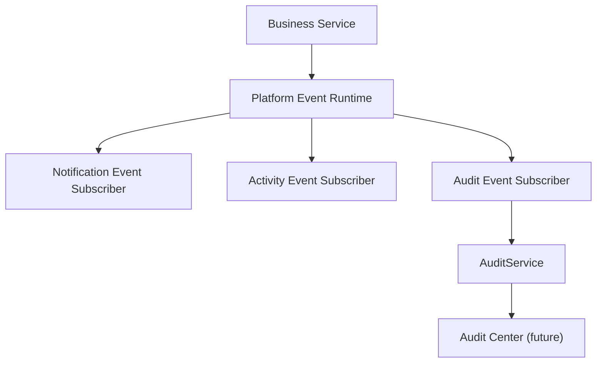

Located in `src/runtime/audit/`. The subscriber listens to audit-worthy Platform Events, maps supported categories to immutable `AuditRecord` objects and delegates persistence to `AuditService`. It is the security and compliance memory layer for future permission enforcement, compliance views, workflow accountability, AI governance and enterprise cloud operations.

### Workspace Architecture

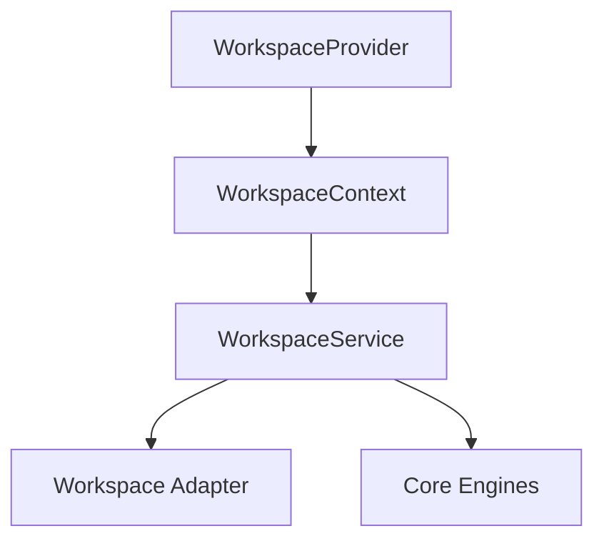

WorkspaceService builds snapshots containing workspace, modules, widgets, preferences, favorites, recent items, notifications and activities. Workspace Context exposes current workspace state to React consumers.

### Preferences Runtime

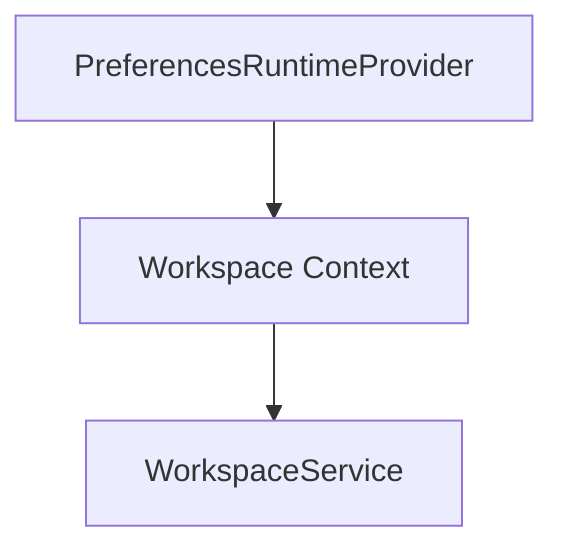

The Preferences Runtime exposes unified access to workspace preferences, user preferences, widget preferences, format preferences and future feature flags. It does not create a settings UI.

### Widget Runtime

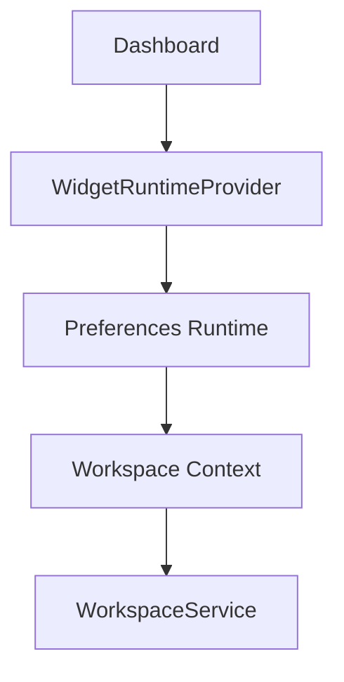

The Widget Runtime prepares current workspace, snapshot, preference runtime, visibility state, loading state, error state, pinned widgets, hidden widgets and refresh operations. It does not render new widgets yet.

### Runtime Validation

Located in `scripts/validate-runtime.cjs` and exposed through `npm run validate:runtime`. The validation layer checks Platform Event Runtime behavior, Notification Event Subscriber behavior, Activity Event Subscriber behavior, Audit Event Subscriber behavior, Permission Enforcement behavior, Permission Runtime Integration, Capability Registry behavior, Manifest System behavior, Module Loader behavior, Plugin Runtime behavior, Preferences Runtime boundaries, Widget Runtime contracts, Workspace Context delegation and Platform Search separation. It is intentionally lightweight and does not introduce a testing framework.

### Communication Flow

1. Core Registry defines modules.
2. Core Engines expose static foundations.
3. Manifest System defines installable component contracts.
4. Module Loader prepares validated manifests for future runtime execution.
5. Platform Capability Registry defines executable capability contracts.
6. Plugin Runtime hosts prepared module descriptors without executing plugin code.
7. Application Services orchestrate engines.
8. Platform UI layers, such as Platform Search, consume services without leaking React into Core Engines.
9. PermissionService exposes the application-facing permission orchestration API.
10. Permission Enforcement prepares structured authorization decisions before future executable capability execution.
11. Platform Event Runtime provides an internal event backbone for future service decoupling.
12. Notification Event Subscriber consumes supported platform events and delegates notification creation to NotificationService.
13. Activity Event Subscriber consumes supported platform events and delegates activity creation to ActivityService.
14. Audit Event Subscriber consumes audit-worthy platform events and delegates audit creation to AuditService.
15. WorkspaceService creates workspace snapshots.
16. Workspace Context exposes active workspace state.
17. Preferences Runtime normalizes runtime preference access.
18. Widget Runtime prepares widget execution context and exposes permission decisions.
19. UI consumes the prepared state.
20. Runtime validation protects key architecture contracts from regressions.

## Current Business Modules

Current pages and components cover dashboard, clients, suppliers, products and stock, sales documents, quotes, invoices, delivery notes, purchases, cash, payment tracking, reports, statistics, PDF documents, users, settings and HR foundations.

## Future Plugin Architecture

Plugins should register capabilities through platform contracts, not by directly modifying UI modules. Future plugin work should extend:

- Core Registry
- Command Registry
- Widget Registry
- Navigation adapters
- AI context adapters
- Permission-aware service contracts

No plugin runtime currently exists.
