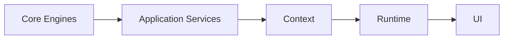

# HicoPilot Architectural Principles

## Purpose

This document is the architecture constitution of HicoPilot.

## When to Create an Engine

Create a Core Engine when the capability is platform-wide, reusable and should not depend on React.

Examples:

- Registry
- Search
- Commands
- Notifications
- Activity
- Favorites
- Recent Items
- Preferences
- Widgets
- Audit

## When to Create a Service

Create an Application Service when orchestration is needed across one or more engines, or when UI should not call engine internals directly.

## When to Create a Context

Create a Context when React consumers need shared state. Context must expose state and delegate operations to services.

## When to Create a Runtime

Create a Runtime when UI elements need an execution environment that prepares state, permissions, visibility, loading and errors from Context.

## When to Create a Provider

Create a Provider when a Context or Runtime requires stable React state boundaries.

## When to Create an Adapter

Create an Adapter when platform data must be mapped into the shape expected by current UI without redesigning the UI.

## Layer Responsibilities

| Layer | Responsibility |
| --- | --- |
| Core Engine | Reusable platform primitives. |
| Service | Orchestration and business-facing methods. |
| Context | React state bridge. |
| Runtime | Prepared execution environment for UI. |
| Adapter | Translation between platform models and UI contracts. |
| UI | Rendering and user interaction. |

## Dependency Direction

## Forbidden Dependencies

- Core Engines must not import React.
- Services must not import UI components.
- Context must not own business rules.
- Runtime must not query Prisma or database directly.
- UI must not duplicate registry definitions.

## Performance Principles

- Avoid duplicated state.
- Avoid duplicated requests.
- Memoize provider values.
- Keep runtime data derived from context where possible.
- Prepare for large dashboards by centralizing widget runtime state.

## Security Principles

- Permissions must be enforced before AI or automation executes actions.
- Tenant isolation must remain a core requirement.
- Sensitive behavior must be auditable.
- Passwords must never be stored in plain text.

## Extensibility Principles

- Add platform contracts before adding feature-specific shortcuts.
- Prefer adapters over rewriting stable UI.
- Keep module metadata reusable.
- Keep public APIs typed.

## Plugin Philosophy

Plugins should extend the platform through registries, services and adapters. They should not patch internal UI implementation directly.

## AI Philosophy

AI suggests; business rules decide. AI must consume permission-aware, workspace-aware context and must not bypass services.
