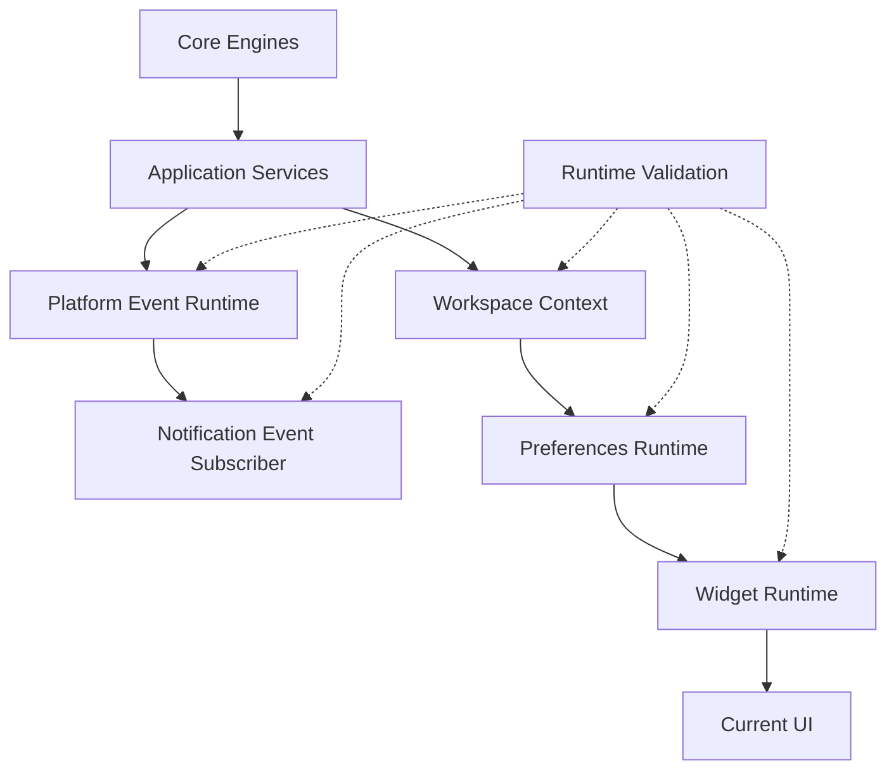
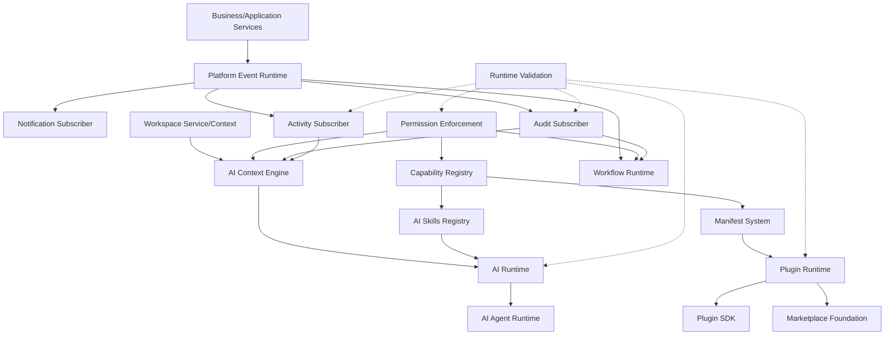
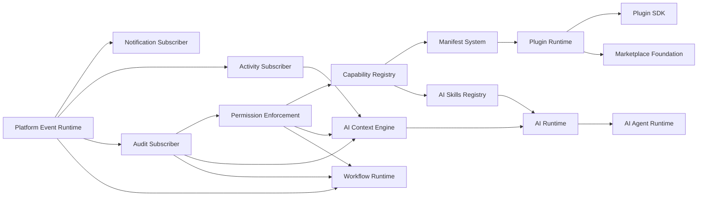
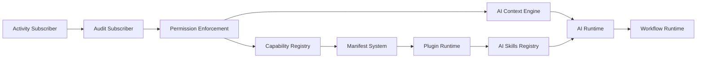

# EPIC 3 — Platform Intelligence

## Executive Summary

EPIC 3 turns HicoPilot from a platform foundation into an intelligent operating layer.

The current repository already contains Core Engines, Application Services, Workspace Context, Widget Runtime, Preferences Runtime, Platform Event Runtime, Notification Event Subscriber, and runtime validation. This is enough to begin Platform Intelligence, but not enough to start AI safely.

The correct implementation order is:

1. Complete event consumers: Activity Subscriber and Audit Subscriber.
2. Introduce platform-level Permission Enforcement.
3. Establish capability contracts: Capability Registry, Manifest System, Plugin Runtime, Plugin SDK.
4. Prepare Marketplace Foundation.
5. Build AI foundations: AI Context Engine, AI Skills Registry, AI Runtime, AI Agent Runtime.
6. Add Workflow Runtime after permissions, audit, plugins, and AI skills exist.

This order follows the Product Vision: permissions before AI, events before integrations, platform before applications, and applications as plugins.

## Architecture Overview

Current architecture:

Target EPIC 3 architecture:

## Implementation Strategy

EPIC 3 should be implemented in four phases.

| Phase | Goal | Why This Comes First |
| --- | --- | --- |
| Phase 1 — Event Intelligence | Activity Subscriber and Audit Subscriber. | Completes the event backbone and creates operational memory. |
| Phase 2 — Safety Layer | Permission Enforcement. | AI, plugins, marketplace, and workflows cannot be safe without a central permission contract. |
| Phase 3 — Extension Layer | Capability Registry, Manifest System, Plugin Runtime, Plugin SDK, Marketplace Foundation. | The Product Vision says applications are plugins; AI must understand capabilities through registries. |
| Phase 4 — Intelligence Layer | AI Context Engine, AI Skills Registry, AI Runtime, AI Agent Runtime, Workflow Runtime. | AI and workflows require events, audit, permissions, workspace context, and capabilities. |

## Dependency Graph

## Sprint Sequence

| Sprint | Name | Outcome |
| --- | --- | --- |
| SPR-212 | Activity Event Subscriber Foundation | Platform events create activity records through ActivityService. |
| SPR-213 | Audit Event Subscriber Foundation | Platform events create audit events through AuditService. |
| SPR-214 | Permission Enforcement Foundation | Central permission service validates module/action/scope access. |
| SPR-215 | Permission Runtime Integration | Runtime layers consume permission decisions without duplicating RBAC logic. |
| SPR-216 | Capability Registry Foundation | Platform capabilities become explicit, typed, discoverable contracts. |
| SPR-217 | Manifest System Foundation | Plugins/applications declare modules, commands, widgets, permissions, events, and AI skills. |
| SPR-218 | Plugin Runtime Foundation | Manifest capabilities can be loaded and validated without UI changes. |
| SPR-219 | Plugin SDK Foundation | Internal SDK contracts are created for plugins, widgets, commands, permissions, workflows, and AI skills. |
| SPR-220 | Marketplace Foundation | Static/in-memory marketplace registry for installable capabilities. |
| SPR-221 | AI Context Engine Foundation | Permission-aware workspace context is prepared for future AI. |
| SPR-222 | AI Skills Registry Foundation | AI capabilities are declared as permission-aware skills. |
| SPR-223 | AI Runtime Foundation | AI requests consume context and skills through controlled runtime contracts. |
| SPR-224 | AI Agent Runtime Foundation | Specialized agents consume AI Runtime without bypassing permissions. |
| SPR-225 | Workflow Runtime Foundation | Event-driven workflows are prepared with audit and permission gates. |
| SPR-226 | Platform Intelligence Validation Review | Validate dependency direction, runtime safety, and documentation before UI work. |

## Future Component Plans

### Activity Subscriber

| Area | Plan |
| --- | --- |
| Purpose | Convert platform events into activity records for timelines, recent activity, workspace memory, and AI context. |
| Dependencies | Platform Event Runtime, ActivityService, Core Activity Engine, runtime validation. |
| Required Prerequisites | SPR-209, SPR-210, SPR-211. |
| Public APIs | `ActivityEventSubscriber`, `mapPlatformEventToActivity`, `activityEventSubscriber`. |
| Platform Events | Subscribes to generic events and records supported categories. |
| Runtime Interaction | Provides activity data to future activity runtime and AI context. |
| Workspace Interaction | Preserves `workspaceId`, actor, resource, module metadata. |
| Security | Must not expose cross-workspace activity; no UI until permission layer exists. |
| Complexity | Low to medium. |
| Risks | Activity mapping may become business-specific too early. Keep generic. |

### Audit Subscriber

| Area | Plan |
| --- | --- |
| Purpose | Convert platform events into audit records for compliance, security, AI traceability, and workflow accountability. |
| Dependencies | Platform Event Runtime, AuditService, Core Audit Engine, Activity Subscriber patterns. |
| Required Prerequisites | Activity Subscriber recommended first for mapping pattern reuse. |
| Public APIs | `AuditEventSubscriber`, `mapPlatformEventToAudit`, `auditEventSubscriber`. |
| Platform Events | Consumes all security-relevant and business-relevant platform events. |
| Runtime Interaction | Feeds future Security Center, AI Context, Workflow Runtime, compliance reports. |
| Workspace Interaction | Must preserve `workspaceId`, `companyId`, `userId`, entity, correlation id. |
| Security | Must be append-oriented and protected from UI mutation in future persistence. |
| Complexity | Medium. |
| Risks | Audit semantics must remain stricter than activity semantics. |

### Permission Enforcement

| Area | Plan |
| --- | --- |
| Purpose | Centralize permission decisions for modules, commands, widgets, plugins, workflows, and AI. |
| Dependencies | Existing `src/lib/rbac.ts`, Core permission requirements, module registry, workspace context. |
| Required Prerequisites | Audit Subscriber, because denied/allowed sensitive decisions must be auditable. |
| Public APIs | `PermissionService`, `canAccess()`, `canExecute()`, `filterAllowed()`, `assertPermission()`. |
| Platform Events | Emits `security.*` or `permissions.*` events for denied access and sensitive grants. |
| Runtime Interaction | Widget Runtime, CommandService, NavigationService, AI Runtime, Plugin Runtime consume permission decisions. |
| Workspace Interaction | Decisions include role, workspace, company, scope, and ownership where available. |
| Security | This is the primary security gate before AI and plugins. |
| Complexity | High. |
| Risks | Current RBAC is demo/static. Avoid pretending it is production-grade. |

### Plugin Runtime

| Area | Plan |
| --- | --- |
| Purpose | Load, validate, and expose plugin capabilities through platform contracts. |
| Dependencies | Permission Enforcement, Capability Registry, Manifest System. |
| Required Prerequisites | Capability Registry and Manifest System. |
| Public APIs | `PluginRuntime`, `loadPlugin()`, `validatePlugin()`, `getPluginCapabilities()`. |
| Platform Events | Emits `plugin.loaded`, `plugin.disabled`, `plugin.validation_failed`. |
| Runtime Interaction | Feeds navigation, commands, widgets, AI skills, workflows. |
| Workspace Interaction | Plugins can be enabled per workspace/company later. |
| Security | No plugin capability should be executable without permissions. |
| Complexity | High. |
| Risks | Overbuilding a marketplace before local plugin contracts are stable. |

### Plugin SDK

| Area | Plan |
| --- | --- |
| Purpose | Provide typed contracts for plugin authors and internal applications. |
| Dependencies | Plugin Runtime, Manifest System, Capability Registry. |
| Required Prerequisites | Plugin Runtime foundation. |
| Public APIs | `definePlugin()`, `defineModule()`, `defineWidget()`, `defineCommand()`, `defineWorkflow()`, `defineAISkill()`. |
| Platform Events | SDK declares emitted/consumed event contracts. |
| Runtime Interaction | SDK output is consumed by Plugin Runtime. |
| Workspace Interaction | SDK supports workspace-aware installation metadata. |
| Security | SDK requires explicit permission declarations. |
| Complexity | Medium to high. |
| Risks | SDK stability too early can freeze poor abstractions. Keep internal first. |

### Capability Registry

| Area | Plan |
| --- | --- |
| Purpose | Single registry for platform capabilities across modules, commands, widgets, workflows, AI skills, and integrations. |
| Dependencies | Core Registry, Command Registry, Widget Registry, permission types. |
| Required Prerequisites | Permission Enforcement. |
| Public APIs | `registerCapability()`, `getCapabilities()`, `getCapabilitiesByType()`, `getRequiredPermissions()`. |
| Platform Events | Emits capability registration/validation events. |
| Runtime Interaction | Plugin Runtime, AI Skills Registry, Workflow Runtime use it. |
| Workspace Interaction | Capabilities can be filtered per workspace. |
| Security | Capabilities must declare permission requirements. |
| Complexity | Medium. |
| Risks | Duplicating existing registries. It must unify metadata, not replace every registry immediately. |

### Manifest System

| Area | Plan |
| --- | --- |
| Purpose | Define installable package metadata for plugins, apps, widgets, workflows, integrations, and AI skills. |
| Dependencies | Capability Registry, Permission Enforcement. |
| Required Prerequisites | Capability Registry. |
| Public APIs | `PluginManifest`, `validateManifest()`, `normalizeManifest()`. |
| Platform Events | Emits manifest validation events. |
| Runtime Interaction | Plugin Runtime consumes manifests. |
| Workspace Interaction | Manifest declares workspace compatibility and default configuration. |
| Security | Manifests must explicitly declare permissions and external access later. |
| Complexity | Medium. |
| Risks | Schema churn. Start static and strict. |

### Marketplace Foundation

| Area | Plan |
| --- | --- |
| Purpose | Static marketplace registry for installable capabilities without code changes. |
| Dependencies | Manifest System, Plugin Runtime, Plugin SDK. |
| Required Prerequisites | Plugin Runtime and internal SDK. |
| Public APIs | `MarketplaceRegistry`, `getListings()`, `getInstallableCapabilities()`. |
| Platform Events | Emits `marketplace.installed`, `marketplace.removed` later. |
| Runtime Interaction | Plugin Runtime reads installed capabilities. |
| Workspace Interaction | Installation scope can be workspace/company later. |
| Security | Marketplace install must require admin permissions in future UI. |
| Complexity | Medium. |
| Risks | UI temptation. EPIC 3 should keep marketplace foundation non-UI. |

### AI Context Engine

| Area | Plan |
| --- | --- |
| Purpose | Build permission-aware business context for AI from workspace, activity, audit, modules, widgets, preferences, recent items, and favorites. |
| Dependencies | Permission Enforcement, WorkspaceService, Activity Subscriber, Audit Subscriber, Core Registries. |
| Required Prerequisites | Permission Enforcement and audit/activity event memory. |
| Public APIs | `AIContextEngine`, `buildContext()`, `getAllowedContextSources()`. |
| Platform Events | Consumes activity/audit/event summaries; may emit `ai.context_built`. |
| Runtime Interaction | AI Runtime consumes prepared context only. |
| Workspace Interaction | Context is workspace-scoped and role-scoped. |
| Security | Must filter all context through permissions before AI sees it. |
| Complexity | High. |
| Risks | Major risk of data leakage if implemented before permissions. |

### AI Skills Registry

| Area | Plan |
| --- | --- |
| Purpose | Declare what AI can suggest, draft, explain, or execute. |
| Dependencies | Capability Registry, Permission Enforcement, AI Context Engine. |
| Required Prerequisites | Capability Registry and Permission Enforcement. |
| Public APIs | `registerAISkill()`, `getAISkills()`, `getExecutableSkills()`. |
| Platform Events | Skills declare emitted events and required audit trails. |
| Runtime Interaction | AI Runtime selects allowed skills. |
| Workspace Interaction | Skills can be enabled per workspace later. |
| Security | Every skill must declare permissions and risk level. |
| Complexity | Medium. |
| Risks | Skills becoming ad hoc prompts. Keep typed contracts. |

### AI Runtime

| Area | Plan |
| --- | --- |
| Purpose | Execute AI requests through context, skills, permissions, audit, and event contracts. |
| Dependencies | AI Context Engine, AI Skills Registry, Permission Enforcement, Audit Subscriber. |
| Required Prerequisites | AI Context Engine and Skills Registry. |
| Public APIs | `AIRuntime`, `run()`, `suggest()`, `explain()`, `prepareAction()`. |
| Platform Events | Emits `ai.requested`, `ai.suggested`, `ai.action_prepared`, `ai.failed`. |
| Runtime Interaction | Future UI and agents consume AI Runtime. |
| Workspace Interaction | Runtime always receives workspace and actor context. |
| Security | No irreversible action without explicit approval. |
| Complexity | High. |
| Risks | External AI provider selection should be delayed until architecture contracts are stable. |

### AI Agent Runtime

| Area | Plan |
| --- | --- |
| Purpose | Host specialized agents for finance, sales, stock, HR, executive summaries, and workflow support. |
| Dependencies | AI Runtime, AI Skills Registry, Permission Enforcement, Workflow Runtime later. |
| Required Prerequisites | AI Runtime. |
| Public APIs | `AgentRuntime`, `registerAgent()`, `runAgent()`, `getAllowedAgents()`. |
| Platform Events | Agents emit AI and workflow-related events. |
| Runtime Interaction | Agents consume AI Runtime, not raw services. |
| Workspace Interaction | Agents are workspace-aware and role-aware. |
| Security | Agent actions must be permission-gated and auditable. |
| Complexity | High. |
| Risks | Agents can become uncontrolled automation. Keep suggest-first. |

### Workflow Runtime

| Area | Plan |
| --- | --- |
| Purpose | Prepare event-driven workflows with permissions, audit, and controlled execution. |
| Dependencies | Platform Event Runtime, Permission Enforcement, Audit Subscriber, Capability Registry, optionally AI Runtime. |
| Required Prerequisites | Permission Enforcement, Audit Subscriber, Capability Registry. |
| Public APIs | `WorkflowRuntime`, `registerWorkflow()`, `evaluate()`, `prepareExecution()`. |
| Platform Events | Consumes events and emits workflow lifecycle events. |
| Runtime Interaction | Future automation UI and AI Runtime can prepare workflows. |
| Workspace Interaction | Workflows are workspace/company scoped. |
| Security | Requires approval gates, audit trails, and permission checks. |
| Complexity | Very high. |
| Risks | Highest automation risk. Do after permissions and audit are stable. |

## Milestones

| Milestone | Sprints | Exit Criteria |
| --- | --- | --- |
| M3.1 Event Memory | SPR-212 to SPR-213 | Activity and audit subscribers validated. |
| M3.2 Security Gate | SPR-214 to SPR-215 | Central permission decisions used by runtime/services. |
| M3.3 Extension Contracts | SPR-216 to SPR-220 | Capabilities, manifests, plugins, SDK, marketplace foundations exist. |
| M3.4 AI Foundation | SPR-221 to SPR-224 | Permission-aware AI context, skills, runtime, and agents exist. |
| M3.5 Workflow Foundation | SPR-225 to SPR-226 | Workflow runtime planned and validated before UI/integrations. |

## Architectural Risks

| Risk | Severity | Mitigation |
| --- | --- | --- |
| AI before permissions | Critical | Permission Enforcement must precede AI Context Engine. |
| Plugin runtime before manifests | High | Manifest System must define contracts first. |
| Workflow runtime before audit | High | Audit Subscriber must exist first. |
| Duplicated registries | Medium | Capability Registry should unify metadata references, not replace every registry immediately. |
| Static RBAC mistaken for production security | High | Document demo/static status and build service boundary first. |
| Marketplace UI too early | Medium | Keep Marketplace Foundation non-UI and in-memory during EPIC 3. |
| Event mappings becoming business-specific | Medium | Keep subscribers generic until business persistence is mature. |
| AI agents bypassing services | Critical | Agents must only use AI Runtime and registered skills. |

## Validation Gates

Every sprint in EPIC 3 must pass:

- `npm run validate:runtime`
- `npm run typecheck`
- `npm run build`

Additional gates:

| Gate | Applies To | Requirement |
| --- | --- | --- |
| Dependency Direction | All sprints | Core never imports React/UI; runtime does not query Prisma directly. |
| Event Consumer Safety | Subscribers | Subscriber errors never interrupt Platform Event Runtime delivery. |
| Permission Gate | Permissions, plugins, AI, workflow | No capability can execute without explicit permission decision. |
| Workspace Isolation | AI, plugin, workflow | Workspace/company scope must be carried through context. |
| Auditability | Permissions, AI, workflow | Sensitive decisions emit auditable events. |
| Documentation | All sprints | ADR and sprint report updated when architecture changes. |

## Success Criteria

EPIC 3 succeeds when:

- Platform events feed notifications, activity, and audit without service coupling.
- Permission Enforcement becomes the shared gate for runtime, plugins, workflows, and AI.
- Capabilities and manifests describe platform extensions consistently.
- Plugin Runtime can validate installable capabilities without UI changes.
- AI Context Engine is permission-aware and workspace-aware.
- AI Runtime consumes registered skills and never bypasses business rules.
- Workflow Runtime is event-driven, permission-gated, and auditable.
- Runtime validation protects the new contracts.

## Critical Path

The critical path is:

## Recommended First Sprint

The first sprint of EPIC 3 should be:

**SPR-212 — Activity Event Subscriber Foundation**

Reason:

- It is the lowest-risk next subscriber after Notification Subscriber.
- It validates the Platform Event Runtime consumer pattern again.
- It creates operational memory needed by AI Context and Executive Workspace later.
- It avoids starting permissions, plugins, or AI before the event memory layer is complete.

## Alignment Check

| Authority | Alignment |
| --- | --- |
| Product Vision | Supports Platform Intelligence, AI as platform, events before integrations, permissions before AI. |
| Engineering Charter | Keeps architecture before features and services before UI. |
| Architecture Principles | Preserves dependency direction and runtime boundaries. |
| ADRs | Extends Platform Event Runtime and Notification Subscriber decisions. |
| Roadmap | Advances Milestone 3 without prematurely building UI. |
