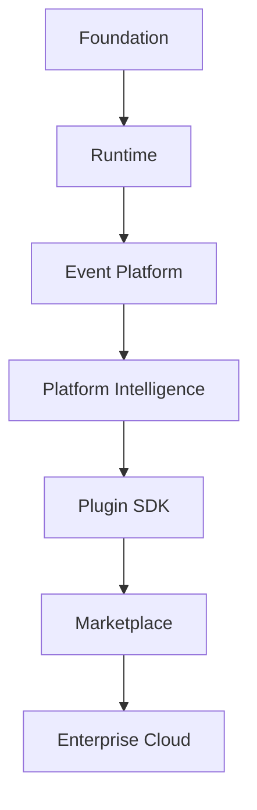

# HicoPilot Product Vision and Long-Term Strategy

## 1. Executive Summary

HicoPilot is an extensible Business Operating System for small and medium businesses.

It exists to help organizations run daily operations, understand operational health, coordinate work, and make better decisions from one coherent platform. HicoPilot is designed for companies that have outgrown fragmented spreadsheets, isolated billing tools, disconnected CRMs, and manual reporting, but do not need the complexity of a traditional enterprise ERP.

The product is built around a platform-first architecture. Business applications such as CRM, finance, HR, inventory, projects, helpdesk, manufacturing, POS, and reporting should run on top of the platform rather than becoming tightly coupled parts of it.

HicoPilot solves three structural problems:

| Problem | HicoPilot Direction |
| --- | --- |
| Business tools are fragmented. | Provide one operating layer for business data, workflows, notifications, commands, and AI context. |
| Traditional ERPs are rigid. | Build a composable platform where applications are plugins. |
| AI tools lack business context and permissions. | Build AI on top of runtime, event, workspace, permission, and audit foundations. |

Over the next 3-5 years, HicoPilot should evolve from a business management application into an Enterprise Business Operating System: cloud-ready, extensible, secure, observable, AI-native, and marketplace-driven.

## 2. Product Vision

HicoPilot is intended to become an AI-native enterprise platform for business operations.

The long-term vision is based on these product pillars:

| Pillar | Meaning |
| --- | --- |
| AI Native Business Operating System | AI is part of platform workflows, not a separate chatbot surface. |
| Platform First | Shared engines, services, runtimes, permissions, and events come before vertical applications. |
| Enterprise First | Architecture must support security, scalability, reliability, observability, and governance from the start. |
| Extensible by Design | New capabilities should be added through plugins, SDKs, registries, and contracts. |
| Marketplace Driven | Customers and developers should be able to install applications, widgets, workflows, integrations, and AI agents. |
| Cloud Ready | The platform should evolve toward secure multi-tenant cloud operations. |
| Plugin Ecosystem | Business modules should be independently installable, upgradeable, and permission-aware. |

The product should not optimize for the largest checklist of ERP features. It should optimize for coherence, extensibility, daily usefulness, and long-term architectural stability.

## 3. What HicoPilot IS

HicoPilot is:

- A **Business Operating System**: a daily control center for business operations.
- An **Enterprise Platform**: a stable foundation for applications, workflows, data, permissions, and integrations.
- A **Runtime Platform**: a system where widgets, preferences, events, notifications, activities, commands, and future plugins execute through shared runtime layers.
- An **AI Platform**: a permission-aware context layer for recommendations, agents, workflow support, and executive assistance.
- A **Plugin Platform**: a host for independently developed business applications.
- An **Application Host**: a shell that coordinates navigation, commands, search, runtime state, workspace context, and extension points.
- A **Marketplace Platform**: a future distribution model for applications, integrations, widgets, automations, and AI agents.
- A **Workflow Platform**: a system where business actions can emit events, trigger subscribers, create activities, notify users, and later execute controlled automations.

## 4. What HicoPilot Is NOT

HicoPilot is not a traditional ERP.

Traditional ERPs are often monolithic, rigid, and difficult to adapt. HicoPilot should remain modular, event-driven, extensible, and experience-oriented.

HicoPilot is not a CRM.

CRM should be one installable application on the platform, not the identity of the platform.

HicoPilot is not accounting software.

Finance and accounting capabilities may exist as applications, integrations, or plugins, but the platform should not be reduced to accounting workflows.

HicoPilot is not inventory software.

Inventory is a business application area, not the platform boundary.

HicoPilot is not billing software.

Invoices, quotes, payments, and documents are important workflows, but they are not the full product vision.

HicoPilot is not a dashboard.

The dashboard is one surface of the operating system. The product must also include runtime, events, commands, search, workflows, permissions, plugins, and AI context.

HicoPilot is not a ChatGPT wrapper.

AI must operate through platform context, permissions, auditability, business rules, and explicit user control.

HicoPilot is not another admin template.

The product must not become a collection of pages. It must remain a structured platform with clear contracts between engines, services, runtimes, contexts, and UI.

## 5. Product Philosophy

| Principle | Product Meaning |
| --- | --- |
| Architecture Before Features | A feature that weakens the platform is not progress. |
| Platform Before Applications | Applications must run on platform contracts, not define them. |
| Composition Over Coupling | Capabilities should compose through services, events, registries, and adapters. |
| Services Before UI | UI consumes prepared state and actions; business orchestration belongs in services. |
| AI Assists Humans | AI recommends, summarizes, detects, and drafts; humans approve business outcomes. |
| Security by Design | Permissions, auditability, tenant boundaries, and safe defaults are platform requirements. |
| Permissions Before AI | AI must never see, infer, or act on data outside user permissions. |
| Events Before Integrations | Internal events create stable integration points before external automations are added. |
| Documentation Driven Development | Architecture decisions and sprint outcomes must remain documented and traceable. |
| Runtime Driven Platform | Runtime layers prepare execution context for widgets, preferences, events, notifications, and future plugins. |

## 6. Platform Architecture Evolution

### Foundation

The foundation contains core registries, shared types, application services, existing business modules, documentation, and build validation.

### Runtime

Runtime layers provide execution context for dashboards, widgets, preferences, workspaces, commands, notifications, and future plugin surfaces.

### Event Platform

The event platform decouples business services from downstream consumers. Notifications, activity, audit, workflows, integrations, and AI should consume platform events instead of receiving direct calls from business services.

### Platform Intelligence

Platform intelligence transforms runtime context, events, activity, and business data into insights, recommendations, summaries, and controlled actions.

### Plugin SDK

The SDK formalizes how external or internal applications register modules, commands, widgets, routes, permissions, events, workflows, and AI skills.

### Marketplace

The marketplace allows customers to install and manage business applications, widgets, workflows, integrations, and AI agents without changing platform code.

### Enterprise Cloud

Enterprise Cloud adds multi-tenant operations, observability, deployment governance, security controls, billing, compliance, and managed scale.

## 7. Plugin Philosophy

Applications are plugins.

CRM, HR, finance, inventory, POS, projects, helpdesk, manufacturing, document management, and analytics should not become hardcoded parts of the platform. They should be installable capabilities that rely on platform contracts.

This separation matters because:

- Applications can evolve independently.
- Customers can install only what they need.
- Permissions can be applied consistently.
- AI can reason over plugin capabilities through a shared registry.
- Marketplace distribution becomes possible.
- Core platform upgrades do not require rewriting applications.

Plugin boundaries should be based on contracts:

| Contract | Responsibility |
| --- | --- |
| Module Registration | Navigation, routes, categories, metadata. |
| Command Registration | Actions available to users and AI. |
| Widget Registration | Dashboard and workspace surfaces. |
| Permission Registration | Required access and operation scopes. |
| Event Registration | Emitted and consumed platform events. |
| Workflow Registration | Declarative process steps and automations. |
| AI Skill Registration | Permission-aware AI capabilities. |

## 8. AI Vision

AI in HicoPilot should become a platform capability, not a page.

Future AI architecture should include:

| AI Capability | Purpose |
| --- | --- |
| AI Context Engine | Builds permission-aware workspace and business context. |
| AI Skills Registry | Defines what AI can suggest or perform. |
| AI Runtime | Executes AI interactions through platform rules. |
| AI Agents | Specialized assistants for finance, sales, stock, HR, and executive work. |
| Workflow AI | Suggests or drafts workflow actions without bypassing approvals. |
| Business AI | Explains trends, anomalies, risks, and opportunities. |
| Executive AI | Gives concise decision support for owners and managers. |
| Permission-Aware AI | Enforces user, role, workspace, and tenant boundaries. |
| Memory-Aware AI | Remembers approved user preferences and business context where allowed. |

AI must follow these constraints:

- AI never bypasses permissions.
- AI never replaces business rules.
- AI never performs irreversible actions without explicit approval.
- AI actions must be auditable.
- AI recommendations should be explainable.
- AI must use platform services, not private UI state.

## 9. Marketplace Vision

The HicoPilot Marketplace should allow users to install:

- Business applications.
- Dashboard widgets.
- AI agents.
- Workflows.
- Integrations.
- Reports.
- Document templates.
- Industry-specific packages.

Marketplace installation should not require code changes in the platform. Installed capabilities should register themselves through SDK contracts and become available through navigation, commands, permissions, runtime, events, and AI context.

## 10. SDK Vision

The future SDK should include:

| SDK | Purpose |
| --- | --- |
| Plugin SDK | Register and package applications. |
| Widget SDK | Build dashboard and workspace widgets. |
| Command SDK | Register actions and command palette entries. |
| Navigation SDK | Register modules and route metadata. |
| Permission SDK | Declare access requirements. |
| Workflow SDK | Define event-driven processes and automations. |
| AI SDK | Register permission-aware AI skills and tools. |

SDK design should prioritize:

- Stable contracts.
- Strong TypeScript types.
- Backward compatibility.
- Minimal runtime coupling.
- Clear validation.
- Safe failure modes.

## 11. Enterprise Principles

HicoPilot must be designed around enterprise-grade principles even while it serves SMEs.

| Principle | Requirement |
| --- | --- |
| Scalability | Platform layers must support many modules, widgets, users, workspaces, and tenants. |
| Maintainability | Code must remain modular, typed, documented, and easy to reason about. |
| Extensibility | New applications should integrate through contracts rather than patches. |
| Security | Authentication, authorization, tenant isolation, and auditability are core requirements. |
| Observability | Future cloud operations must expose logs, events, metrics, and health signals. |
| Reliability | Runtime failures must degrade safely and avoid cascading failures. |
| Testability | Platform contracts must be validated before features depend on them. |
| Performance | Runtime layers must avoid unnecessary requests, renders, and duplication. |
| Backward Compatibility | Existing plugins and business workflows should keep working across platform upgrades. |

## 12. Five-Year Roadmap

| Year | Strategic Theme | Expected Outcome |
| --- | --- | --- |
| Year 1 | Platform | Core engines, services, runtimes, events, documentation, and validation become stable. |
| Year 2 | Enterprise Runtime | Workspace, permissions, notifications, activity, audit, workflows, and observability mature. |
| Year 3 | Marketplace | Plugin SDK and marketplace distribution become viable for applications and widgets. |
| Year 4 | Enterprise AI | AI context, agents, workflow AI, executive AI, and permission-aware memory become platform capabilities. |
| Year 5 | Cloud Ecosystem | HicoPilot becomes a managed cloud ecosystem with marketplace, integrations, governance, and scale. |

## 13. Product Success Metrics

HicoPilot success should be measured by platform maturity, not only feature count.

| Metric | Why It Matters |
| --- | --- |
| Number of Plugins | Measures extensibility and ecosystem growth. |
| Marketplace Ecosystem | Shows whether distribution works beyond core development. |
| AI Agent Ecosystem | Measures AI platform usefulness across business domains. |
| Enterprise Adoption | Validates security, reliability, and operational trust. |
| Developer Experience | Determines whether plugins and SDKs can scale. |
| Performance | Ensures the platform remains fast as capabilities grow. |
| Security | Measures trustworthiness, tenant safety, and compliance readiness. |
| API Stability | Protects plugins, integrations, and customers from breaking changes. |
| Runtime Reliability | Confirms that platform layers can handle failure safely. |
| Documentation Quality | Ensures future teams can build consistently. |

## 14. Final Product Statement

HicoPilot is an extensible Enterprise Business Operating System.

It is not a traditional ERP, CRM, billing tool, dashboard, or AI wrapper. It is a platform that hosts business applications, coordinates runtime state, emits and consumes business events, enforces permissions, enables workflows, supports plugins, and prepares secure business context for AI.

The long-term goal is to become the operating layer for modern SMEs: modular enough for small companies, disciplined enough for enterprise use, and intelligent enough to help users understand, decide, and act with confidence.
