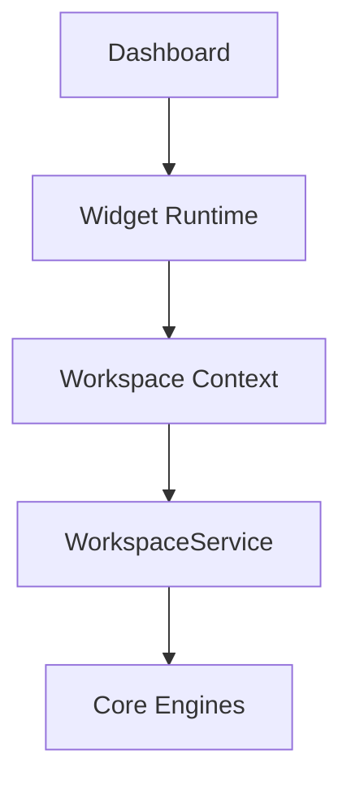

# SPR-207 — Widget Runtime Foundation

## Summary

SPR-207 created the invisible Widget Runtime foundation for future dashboard widgets.

## Objective

Create a runtime layer that prepares shared widget execution context without redesigning the Dashboard, adding widgets or changing layout.

## Architecture

## Files Created

- `src/widgets/widget-runtime.types.ts`
- `src/widgets/widget-runtime-context.ts`
- `src/widgets/widget-runtime-provider.tsx`
- `src/widgets/use-widget-runtime.ts`
- `src/widgets/index.ts`
- `docs/sprints/SPR-207.md`

## Files Modified

- `src/components/dashboard-workspace-bridge.tsx`
- `docs/02_PROJECT_STATUS.md`
- `docs/03_DECISIONS_LOG.md`

## Public APIs

- `WidgetRuntimeProvider`
- `WidgetRuntimeContext`
- `useWidgetRuntime()`
- `WidgetRuntimeValue`
- `WidgetRuntimeItem`

## Validation

- `npm run typecheck`: passed during sprint execution.
- `npm run build`: passed during sprint execution.

## Known Risks

- Widget permissions are represented but not enforced yet.
- Widget rendering remains the responsibility of current dashboard components.
- Runtime data comes from static/in-memory workspace snapshots.

## Future Work

- Add widget rendering contracts.
- Add widget permission enforcement.
- Add hidden and pinned widget controls.
- Add widget preferences.
- Add lazy loading for heavy widgets.

## Release Notes

No user-facing behavior changed. This sprint created platform infrastructure only.
