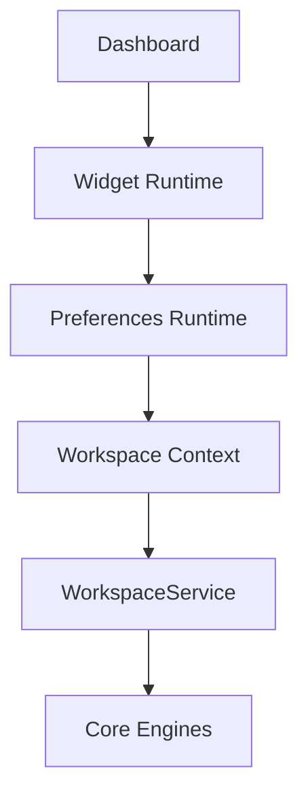

# SPR-208 — Preferences Runtime Foundation

## Summary

SPR-208 created the Preferences Runtime foundation and inserted it between Widget Runtime and Workspace Context.

## Objective

Create a runtime layer that distributes preferences consistently across the platform without changing UI, dashboard layout, routes, permissions, database or Prisma.

## Architecture

## Files Created

- `src/preferences/preferences-runtime.types.ts`
- `src/preferences/preferences-runtime-context.ts`
- `src/preferences/preferences-runtime-provider.tsx`
- `src/preferences/use-preferences-runtime.ts`
- `src/preferences/index.ts`
- `docs/sprints/SPR-208.md`

## Files Modified

- `src/components/dashboard-workspace-bridge.tsx`
- `src/widgets/widget-runtime-provider.tsx`
- `src/widgets/widget-runtime.types.ts`
- `docs/02_PROJECT_STATUS.md`
- `docs/03_DECISIONS_LOG.md`
- `docs/05_ARCHITECTURE.md`
- `docs/06_CODING_STANDARDS.md`

## Public APIs

- `PreferencesRuntimeProvider`
- `PreferencesRuntimeContext`
- `usePreferencesRuntime()`
- `PreferenceRuntimeValue`
- `PreferenceRuntimeFormat`
- `FeatureFlagState`

## Validation

- `npm run typecheck`
- `npm run build`

## Known Risks

- Preferences remain static/in-memory through the existing workspace snapshot.
- No settings UI or preference editing workflow exists.
- Feature flags are prepared as runtime state but are not yet a product feature.

## Future Work

- Add preference editing workflow.
- Add persistent preference updates.
- Connect runtime preferences to theme, density and locale UI when explicitly requested.
- Add permission-aware feature flags when the security epic begins.

## Release Notes

No user-facing behavior changed. This sprint created platform runtime infrastructure only.
