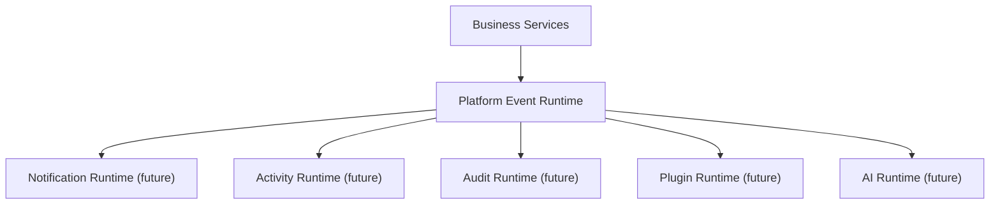

# SPR-209 — Platform Event Runtime Foundation

## Summary

SPR-209 created the Platform Event Runtime foundation for internal, synchronous, in-memory event communication.

## Objective

Create a lightweight event backbone that future business services can use to emit events without knowing which runtime consumes them.

## Architecture

## Files Created

- `src/runtime/platform-events/platform-event.types.ts`
- `src/runtime/platform-events/platform-event-registry.ts`
- `src/runtime/platform-events/platform-event-runtime.ts`
- `src/runtime/platform-events/index.ts`
- `src/runtime/index.ts`
- `docs/sprints/SPR-209.md`

## Files Modified

- `docs/02_PROJECT_STATUS.md`
- `docs/03_DECISIONS_LOG.md`
- `docs/05_ARCHITECTURE.md`

## Public APIs

- `PlatformEventRuntime`
- `platformEventRuntime`
- `EventRegistry`
- `PlatformEvent`
- `PlatformEventInput`
- `PlatformEventType`
- `PlatformEventCategory`
- `EventSubscriber`
- `EventSubscription`
- `EventEmitter`

## Validation

- `npm run typecheck`
- `npm run build`

## Known Risks

- Events are in-memory only.
- The runtime is not yet connected to business services.
- Notification, activity, audit, plugin and AI runtimes are future consumers only.

## Future Work

- Integrate selected application services with event emission.
- Create Notification Runtime consumer.
- Create Activity Runtime consumer.
- Create Audit Runtime consumer.
- Add permission-aware AI event consumers.

## Release Notes

No user-facing behavior changed. This sprint created internal platform infrastructure only.
