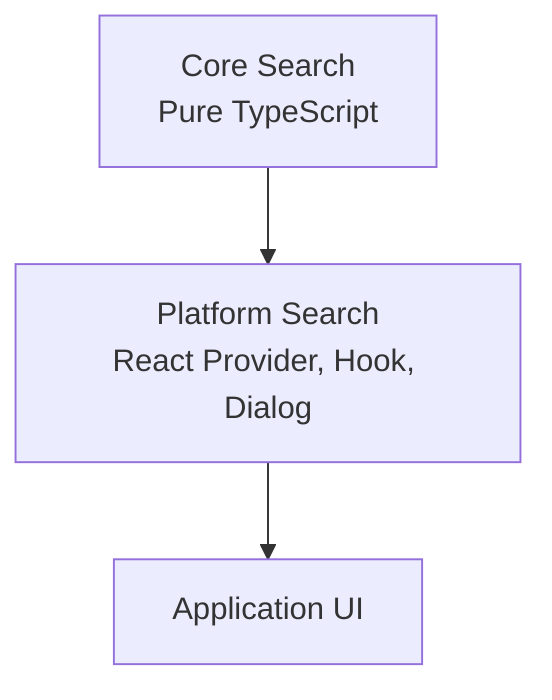

# SPR-209A — Core Search Separation

## Summary

SPR-209A separates React-specific universal search code from Core Search so the Core Engine remains framework-agnostic.

## Objective

Resolve the Architecture Review 1.0 warning that React provider, hook and dialog files existed inside `src/core/search/`.

## Architecture

`src/core/search/` now owns only types, registry and search services. `src/platform/search/` owns universal search React integration.

## Files Created

- `src/platform/search/components/index.ts`
- `src/platform/search/components/universal-search-dialog.tsx`
- `src/platform/search/index.ts`
- `docs/sprints/SPR-209A.md`

## Files Modified

- `src/components/erp-shell.tsx`
- `src/components/topbar.tsx`
- `src/core/search/index.ts`
- `docs/02_PROJECT_STATUS.md`
- `docs/03_DECISIONS_LOG.md`
- `docs/05_ARCHITECTURE.md`

## Public APIs

- `@/core/search` continues to expose pure search types, registry and services.
- `@/platform/search` exposes the universal search provider, hook and dialog for React consumers.

## Validation

- Core Search contains no React, UI, provider, hook or component files.
- Search UI behavior is preserved.
- No routes, permissions, database, Prisma, dashboard or sidebar behavior changed.
- `npm run typecheck` is required.
- `npm run build` is required.

## Known Risks

- Search is still module-focused and remains intentionally limited until future platform search expansion.

## Future Work

- Continue to keep Core Engines framework-agnostic.
- Proceed to SPR-210 after validation.

## Release Notes

- Internal architecture cleanup only.
- No visible user-facing change.
