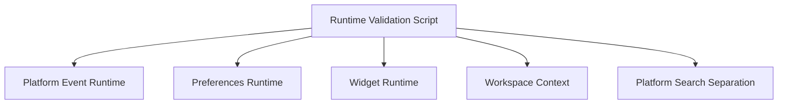

# SPR-210 — Runtime Validation Foundation

## Summary

SPR-210 adds lightweight runtime architecture validation for HicoPilot platform foundations.

## Objective

Protect the platform before future Notification, Activity, Audit, Plugin and AI runtimes are added.

## Architecture

The validation script is dependency-free and runs through Node. It uses TypeScript transpilation only for local runtime module loading.

## Files Created

- `scripts/validate-runtime.cjs`
- `docs/sprints/SPR-210.md`

## Files Modified

- `package.json`
- `src/runtime/platform-events/platform-event-registry.ts`
- `src/runtime/platform-events/platform-event-runtime.ts`
- `docs/02_PROJECT_STATUS.md`
- `docs/03_DECISIONS_LOG.md`
- `docs/05_ARCHITECTURE.md`
- `docs/07_TESTING_RULES.md`

## Public APIs

- Added npm script: `npm run validate:runtime`
- Platform Event Runtime now prevents duplicate identical subscriber registrations.
- Platform Event Runtime isolates subscriber errors so one failing subscriber does not block later subscribers.

## Validation

`npm run validate:runtime` checks:

- Event Runtime emit, subscribe, unsubscribe, once and clear behavior.
- Event matcher behavior by type and category.
- Duplicate subscriber protection.
- Safe subscriber error isolation.
- Preferences Runtime dependency boundary.
- Widget Runtime dependency boundary and typed runtime contract.
- Workspace Context delegation to WorkspaceService.
- Core Search separation from React/UI code.

## Known Risks

- Runtime validation is not a full unit test suite.
- React runtime providers are validated through focused source contract checks rather than component rendering.

## Future Work

- Add deeper unit tests when a dedicated test framework is introduced.
- Expand runtime validation as Notification, Activity, Audit, Plugin and AI runtimes are implemented.

## Release Notes

- Added architecture regression validation.
- No UI, route, database, Prisma or permission changes.
