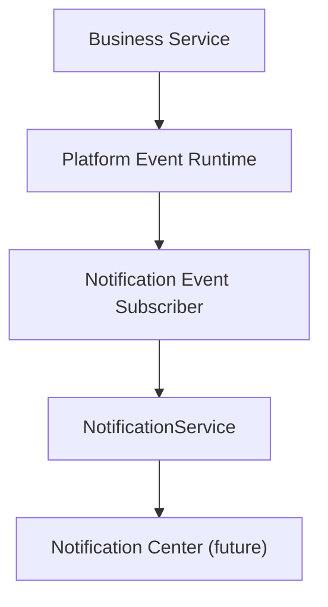

# SPR-211 — Notification Event Subscriber Foundation

## Summary

SPR-211 creates the first consumer of the Platform Event Runtime: a Notification Event Subscriber.

## Objective

Prove that platform events can be transformed into notifications without direct coupling between business services and NotificationService.

## Architecture

The subscriber is framework-independent, synchronous and in-memory. It does not create UI or business-specific notification rules.

## Files Created

- `src/runtime/notifications/notification-event-subscriber.types.ts`
- `src/runtime/notifications/notification-event-mapper.ts`
- `src/runtime/notifications/notification-event-subscriber.ts`
- `src/runtime/notifications/index.ts`
- `docs/sprints/SPR-211.md`

## Files Modified

- `src/runtime/index.ts`
- `scripts/validate-runtime.cjs`
- `docs/02_PROJECT_STATUS.md`
- `docs/03_DECISIONS_LOG.md`
- `docs/05_ARCHITECTURE.md`
- `docs/07_TESTING_RULES.md`

## Public APIs

- `NotificationEventSubscriber`
- `notificationEventSubscriber`
- `mapPlatformEventToNotification`
- `toNotificationInput`
- `NotificationEventRequest`
- `NotificationEventMapper`

## Validation

`npm run validate:runtime` now checks:

- Notification subscriber registers once.
- Supported events produce notifications.
- Unsupported events are ignored.
- Duplicate events do not duplicate notifications.
- Subscriber mapping errors do not interrupt Platform Event Runtime delivery.

## Known Risks

- Notifications remain static/in-memory through the existing notification foundation.
- The subscriber maps only generic event categories; business-specific notification rules are intentionally future work.

## Future Work

- Create Activity Event Subscriber.
- Create Audit Event Subscriber.
- Integrate selected business services with event emission.
- Build Notification Center UI in a future UI sprint.

## Release Notes

- Added internal notification event consumption.
- No UI, route, database, Prisma or permission changes.
