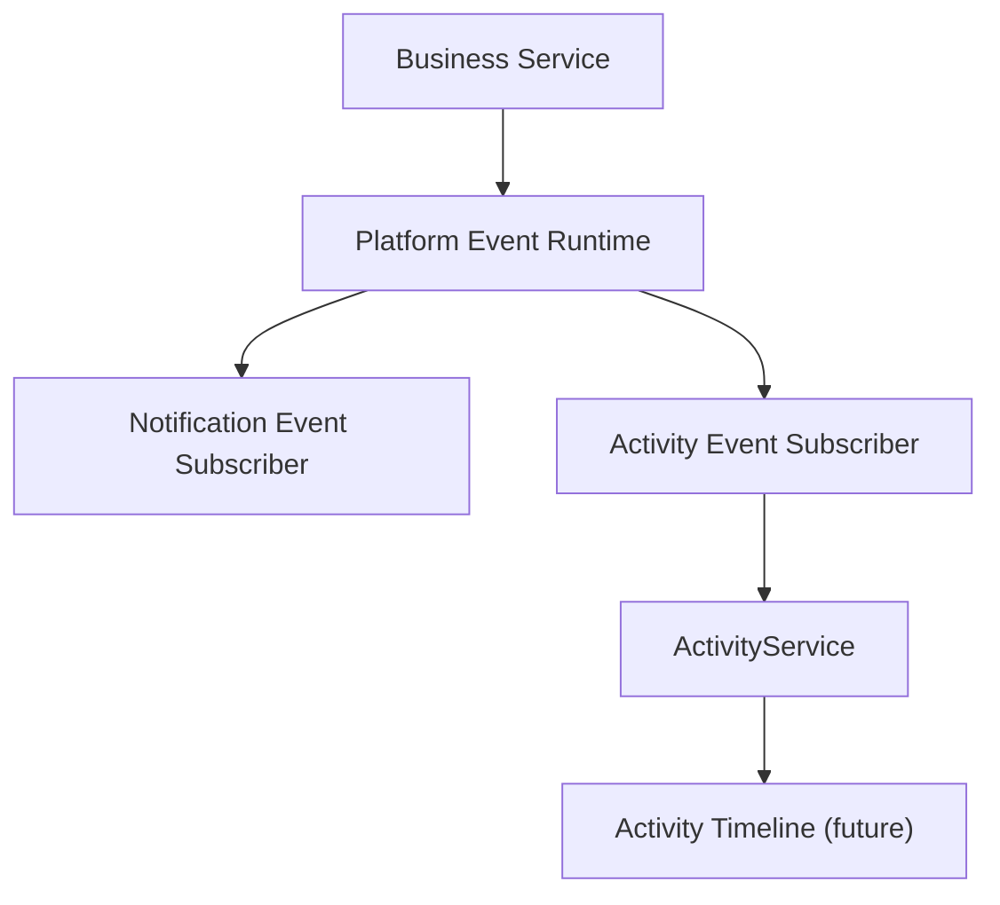

# SPR-212 — Activity Event Subscriber Foundation

## Summary

SPR-212 creates the Activity Event Subscriber, the operational memory layer for HicoPilot.

## Objective

Transform supported Platform Events into activity records without coupling business services to ActivityService.

## Architecture

The subscriber is framework-independent, synchronous and in-memory. It does not create UI or business-specific activity rules.

## Files Created

- `src/runtime/activity/activity-event-subscriber.types.ts`
- `src/runtime/activity/activity-event-mapper.ts`
- `src/runtime/activity/activity-event-subscriber.ts`
- `src/runtime/activity/index.ts`
- `docs/sprints/SPR-212.md`

## Files Modified

- `src/runtime/index.ts`
- `scripts/validate-runtime.cjs`
- `docs/02_PROJECT_STATUS.md`
- `docs/03_DECISIONS_LOG.md`
- `docs/05_ARCHITECTURE.md`
- `docs/07_TESTING_RULES.md`

## Public APIs

- `ActivityEventSubscriber`
- `activityEventSubscriber`
- `mapPlatformEventToActivity`
- `toActivityInput`
- `ActivityEventModel`
- `ActivityEventMapper`

## Validation

`npm run validate:runtime` now checks:

- Activity subscriber registers once.
- Supported events produce activities.
- Unsupported events are ignored.
- Duplicate events do not duplicate activities.
- Subscriber mapping errors do not interrupt Platform Event Runtime delivery.

## Known Risks

- Activity records remain static/in-memory through the existing activity foundation.
- The subscriber maps only generic event categories; business-specific activity rules are intentionally future work.

## Future Work

- Create Audit Event Subscriber.
- Integrate selected business services with event emission.
- Build Activity Timeline UI in a future UI sprint.
- Feed AI Context Engine with permission-aware activity memory after permission enforcement exists.

## Release Notes

- Added internal activity event consumption.
- No UI, route, database, Prisma or permission changes.
