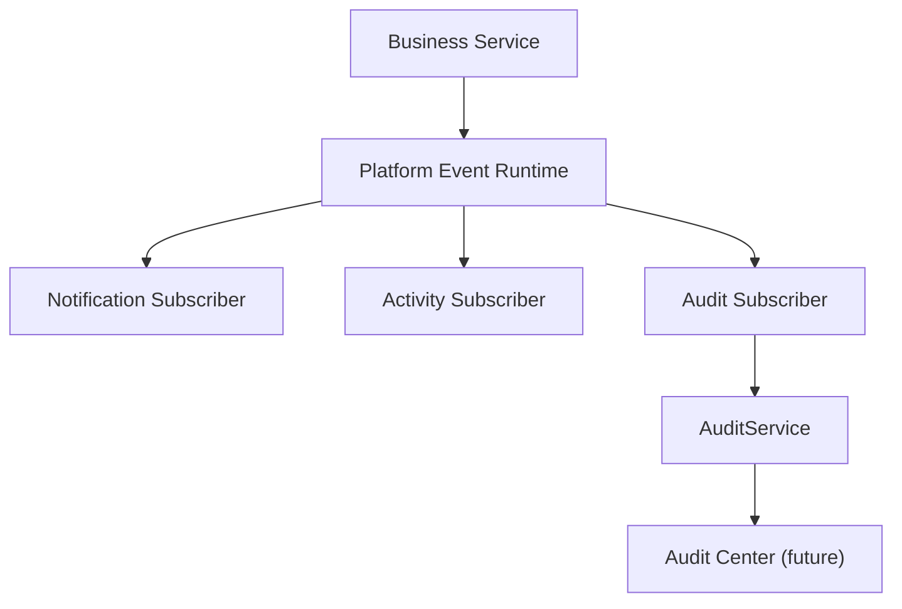

# SPR-213 — Audit Record & Event Subscriber Foundation

## Summary

SPR-213 creates the Audit Record model and Audit Event Subscriber, establishing HicoPilot's security and compliance memory layer.

## Objective

Transform supported audit-worthy Platform Events into immutable audit records without coupling business services to AuditService.

## Architecture

The subscriber is framework-independent, synchronous and in-memory. It does not create UI or business-specific audit policies.

## Files Created

- `src/runtime/audit/audit-event-subscriber.types.ts`
- `src/runtime/audit/audit-event-mapper.ts`
- `src/runtime/audit/audit-event-subscriber.ts`
- `src/runtime/audit/index.ts`
- `docs/sprints/SPR-213.md`

## Files Modified

- `src/runtime/index.ts`
- `scripts/validate-runtime.cjs`
- `docs/02_PROJECT_STATUS.md`
- `docs/03_DECISIONS_LOG.md`
- `docs/05_ARCHITECTURE.md`
- `docs/07_TESTING_RULES.md`

## Public APIs

- `AuditEventSubscriber`
- `auditEventSubscriber`
- `mapPlatformEventToAuditRecord`
- `toAuditEventInput`
- `AuditRecord`
- `AuditEventMapper`

## Validation

`npm run validate:runtime` now checks:

- Audit subscriber registers once.
- Supported events produce audit records.
- Unsupported events are ignored.
- Duplicate event ids do not duplicate audit records.
- Subscriber mapping errors do not interrupt Platform Event Runtime delivery.
- Mapped `AuditRecord` objects are immutable.

## Known Risks

- Audit records remain static/in-memory through the existing audit foundation.
- The subscriber maps only generic audit-worthy event categories; business-specific audit policies are intentionally future work.
- Core Audit persistence is not append-only yet because no database persistence is introduced in this sprint.

## Future Work

- Create Permission Enforcement Foundation.
- Integrate selected business services with event emission.
- Add persistent append-only audit storage in a future persistence/security sprint.
- Build Audit Center UI in a future UI sprint.

## Release Notes

- Added internal audit event consumption.
- No UI, route, database, Prisma or permission changes.
