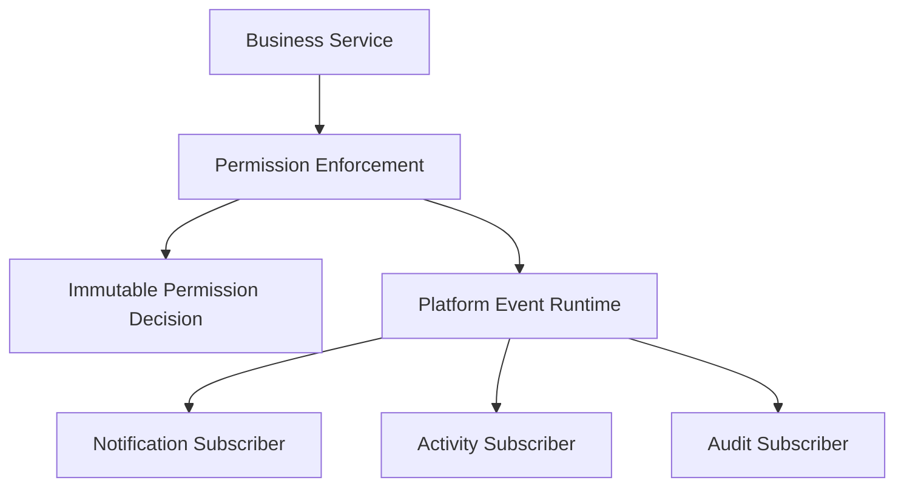

# SPR-214 — Permission Enforcement Foundation

## Summary

SPR-214 creates the framework-independent Permission Enforcement foundation for HicoPilot.

The sprint does not redesign RBAC, authentication, users, database schema, Prisma, routes or UI. It establishes a reusable authorization decision layer that future commands, widgets, plugins, workflows, AI capabilities and APIs can consume.

## Objective

Create a centralized permission enforcement layer that evaluates permissions and returns explicit structured decisions instead of boolean-only results.

## Architecture

The foundation currently performs pure synchronous evaluation and reuses the existing static RBAC matrix.

## Files Created

- `src/runtime/permissions/permission-enforcement.types.ts`
- `src/runtime/permissions/permission-enforcement.constants.ts`
- `src/runtime/permissions/permission-enforcement.utils.ts`
- `src/runtime/permissions/permission-enforcement.ts`
- `src/runtime/permissions/index.ts`
- `docs/sprints/SPR-214.md`

## Files Modified

- `src/runtime/index.ts`
- `scripts/validate-runtime.cjs`
- `docs/02_PROJECT_STATUS.md`
- `docs/03_DECISIONS_LOG.md`
- `docs/05_ARCHITECTURE.md`
- `docs/07_TESTING_RULES.md`

## Public APIs

- `PermissionEnforcement`
- `permissionEnforcement`
- `PermissionDeniedError`
- `PermissionContext`
- `PermissionDecision`
- `PermissionResource`
- `PermissionSubject`
- `PermissionEvaluator`

## Validation

- `npm run validate:runtime` checks structured decisions, safe denial of unsupported permissions, deterministic evaluation, immutability and absence of UI dependencies.
- `npm run typecheck` must pass.
- `npm run build` must pass.

## Known Risks

- Current permissions are still backed by static/demo RBAC data.
- Runtime consumers do not enforce decisions yet.
- No permission UI, policy editor, persistence or enterprise policy engine exists.

## Future Work

- SPR-215 should integrate Permission Enforcement into runtime consumers such as Widget Runtime, Command Runtime, Navigation and future Plugin/AI layers.
- Sensitive denied decisions should later emit platform events for audit and security visibility.

## Release Notes

HicoPilot now has a central permission decision foundation ready for future runtime integration.
