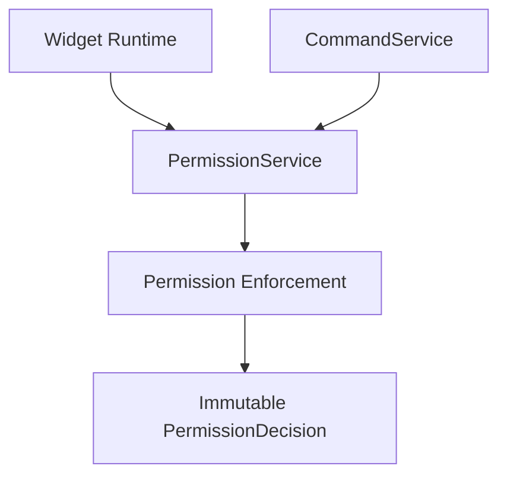

# SPR-215 — Permission Runtime Integration

## Summary

SPR-215 integrates the Permission Enforcement foundation into the first runtime and service consumers.

The sprint keeps the UI visually unchanged. It does not redesign navigation, authentication, RBAC, database schema, Prisma or routes.

## Objective

Make runtime layers consume structured permission decisions without duplicating RBAC logic.

## Architecture

## Files Created

- `src/services/permissions/PermissionService.ts`
- `src/services/permissions/index.ts`
- `docs/sprints/SPR-215.md`

## Files Modified

- `src/services/index.ts`
- `src/core/commands/types.ts`
- `src/services/commands/CommandService.ts`
- `src/widgets/widget-runtime.types.ts`
- `src/widgets/widget-runtime-provider.tsx`
- `scripts/validate-runtime.cjs`
- `docs/02_PROJECT_STATUS.md`
- `docs/03_DECISIONS_LOG.md`
- `docs/05_ARCHITECTURE.md`
- `docs/07_TESTING_RULES.md`

## Public APIs

- `PermissionService`
- `permissionService`
- `PermissionRuntimeSubjectInput`
- `WidgetPermissionState.decisions`
- `CommandService.getCommandPermissionDecision()`

## Validation

- Runtime validation checks that Widget Runtime consumes `PermissionService`.
- Runtime validation checks that widget visibility remains based on the existing enabled state.
- Runtime validation checks that CommandService evaluates command permissions through `PermissionService`.
- `npm run typecheck` must pass.
- `npm run build` must pass.

## Known Risks

- Permission integration currently uses the existing static/demo RBAC model.
- Navigation, Plugin, Marketplace, Workflow and AI runtimes are not yet integrated.
- Widget permission decisions are exposed but not used to hide widgets yet.

## Future Work

- SPR-216 should create the Capability Registry foundation.
- Later sprints should connect PermissionService to Navigation, Plugin Runtime, AI Runtime and Workflow Runtime.

## Release Notes

HicoPilot runtime consumers can now consume structured permission decisions through a shared service boundary.
