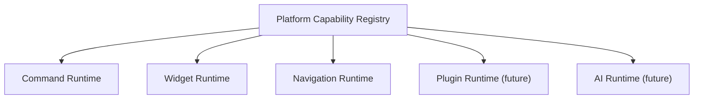

# SPR-216 — Platform Capability Registry Foundation

## Summary

SPR-216 creates the Platform Capability Registry foundation.

The registry is the future common source of truth for executable capability contracts across commands, widgets, navigation, services, runtimes, plugins, AI skills, AI agents, workflow actions and API endpoints.

## Objective

Create a generic, strongly typed, framework-independent registry for platform capabilities.

## Architecture

## Files Created

- `src/core/capabilities/capability.types.ts`
- `src/core/capabilities/capability.utils.ts`
- `src/core/capabilities/capability.registry.ts`
- `src/core/capabilities/index.ts`
- `docs/sprints/SPR-216.md`

## Files Modified

- `src/core/index.ts`
- `scripts/validate-runtime.cjs`
- `docs/02_PROJECT_STATUS.md`
- `docs/03_DECISIONS_LOG.md`
- `docs/05_ARCHITECTURE.md`
- `docs/07_TESTING_RULES.md`

## Public APIs

- `PlatformCapability`
- `PlatformCapabilityInput`
- `PlatformCapabilityRegistry`
- `platformCapabilityRegistry`
- `registerCapability()`
- `registerCapabilities()`
- `findCapability()`
- `findCapabilitiesByCategory()`
- `findCapabilitiesByType()`
- `capabilityExists()`
- `removeCapability()`
- `clearCapabilities()`
- `listCapabilities()`

## Validation

- Runtime validation checks registration and bulk registration.
- Runtime validation checks duplicate id rejection.
- Runtime validation checks id lookup, category filtering and type filtering.
- Runtime validation checks immutable capability objects and metadata.
- Runtime validation checks deterministic listing.
- Runtime validation checks absence of React, UI and service dependencies.

## Known Risks

- The registry is not yet consumed by CommandService, Widget Runtime, Navigation, Plugin Runtime or AI Runtime.
- The registry is in-memory only.
- It does not implement plugin manifests or marketplace behavior.

## Future Work

- SPR-217 should introduce the Manifest System Foundation on top of capability contracts.
- Future integration sprints should register existing command, widget and navigation capabilities.

## Release Notes

HicoPilot now has a common platform capability contract for future executable features.
