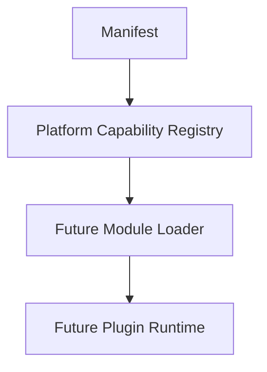

# SPR-217 — Manifest System Foundation

## Summary

SPR-217 creates the HicoPilot Manifest System foundation.

The manifest is the future contract between HicoPilot and installable components. This sprint does not implement plugins, module loading, marketplace, publishing or runtime execution.

## Objective

Create a generic, immutable and framework-independent manifest model with structured validation.

## Architecture

## Files Created

- `src/core/manifests/manifest.types.ts`
- `src/core/manifests/manifest.utils.ts`
- `src/core/manifests/manifest.validation.ts`
- `src/core/manifests/index.ts`
- `docs/sprints/SPR-217.md`

## Files Modified

- `src/core/index.ts`
- `scripts/validate-runtime.cjs`
- `docs/02_PROJECT_STATUS.md`
- `docs/03_DECISIONS_LOG.md`
- `docs/05_ARCHITECTURE.md`
- `docs/07_TESTING_RULES.md`

## Public APIs

- `HicoPilotManifest`
- `ManifestInput`
- `ManifestCapability`
- `ManifestDependency`
- `ManifestPermission`
- `ManifestCompatibility`
- `ManifestValidationResult`
- `createManifest()`
- `validateManifest()`
- `isValidManifestVersion()`

## Validation

- Manifest creation is immutable.
- Manifest validation returns structured results.
- Duplicate manifest ids, capability ids and dependency ids are reported.
- Semantic versions are validated.
- Invalid dependencies are reported.
- Core Manifest System has no React, UI, services or runtime dependencies.

## Known Risks

- No Module Loader exists yet.
- No Plugin Runtime consumes manifests yet.
- No Marketplace installation flow exists yet.
- Compatibility declarations are modeled but not enforced yet.

## Future Work

- SPR-218 should create the Plugin Runtime Foundation.
- Future sprints should map validated manifests into capability registrations.

## Release Notes

HicoPilot now has a stable manifest contract for future installable components.
