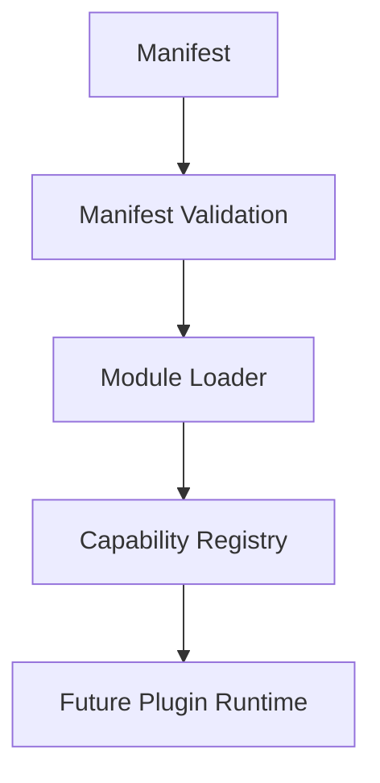

# SPR-218 — Module Loader Foundation

## Summary

SPR-218 creates the Module Loader Foundation.

The loader prepares installable platform components for future execution. It validates manifests, checks compatibility and dependencies, registers capabilities and returns immutable descriptors. It does not execute modules or implement Plugin Runtime.

## Objective

Create a deterministic, framework-independent loading pipeline that prepares modules from manifests without executing code.

## Architecture

## Files Created

- `src/core/module-loader/module-loader.types.ts`
- `src/core/module-loader/module-loader.utils.ts`
- `src/core/module-loader/module-loader.ts`
- `src/core/module-loader/index.ts`
- `docs/sprints/SPR-218.md`

## Files Modified

- `src/core/index.ts`
- `scripts/validate-runtime.cjs`
- `docs/02_PROJECT_STATUS.md`
- `docs/03_DECISIONS_LOG.md`
- `docs/05_ARCHITECTURE.md`
- `docs/07_TESTING_RULES.md`

## Public APIs

- `ModuleLoader`
- `moduleLoader`
- `ModuleDescriptor`
- `ModuleLoadRequest`
- `ModuleLoadResult`
- `ModuleDependency`
- `ModuleCompatibility`
- `evaluateCompatibility()`
- `evaluateDependencies()`
- `compareSemanticVersions()`

## Validation

- Valid manifests can be loaded.
- Manifest capabilities are registered in a provided capability registry.
- Unsupported platform versions are rejected.
- Missing required dependencies are reported.
- Duplicate modules and duplicate capabilities are reported.
- Circular dependencies are detected.
- Module descriptors are immutable.
- Entries are preserved as metadata and never executed.

## Known Risks

- The loader does not execute modules.
- The loader does not install dependencies.
- Compatibility checking is intentionally simple.
- Plugin Runtime does not exist yet.

## Future Work

- SPR-219 should create Plugin Runtime Foundation on top of immutable module descriptors.
- Future work should connect manifest loading to marketplace and plugin registries.

## Release Notes

HicoPilot now has a deterministic preparation step between manifests and future plugin execution.
