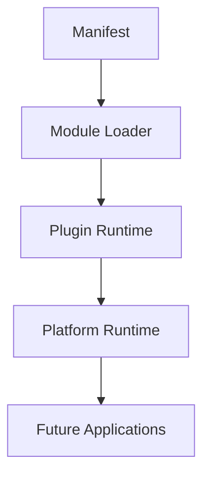

# SPR-219 — Plugin Runtime Foundation

## Summary

SPR-219 creates the Plugin Runtime Foundation.

The runtime hosts prepared `ModuleDescriptor` objects and tracks lifecycle state. It does not execute plugin code, perform dynamic imports, install marketplace packages or implement a Plugin SDK.

## Objective

Create a deterministic, framework-independent runtime foundation for registering, enabling, disabling, listing and removing prepared plugins.

## Architecture

## Files Created

- `src/runtime/plugins/plugin-runtime.types.ts`
- `src/runtime/plugins/plugin-runtime.utils.ts`
- `src/runtime/plugins/plugin-runtime.ts`
- `src/runtime/plugins/index.ts`
- `docs/sprints/SPR-219.md`

## Files Modified

- `src/runtime/index.ts`
- `scripts/validate-runtime.cjs`
- `docs/02_PROJECT_STATUS.md`
- `docs/03_DECISIONS_LOG.md`
- `docs/05_ARCHITECTURE.md`
- `docs/07_TESTING_RULES.md`

## Public APIs

- `PluginRuntime`
- `pluginRuntime`
- `PluginDescriptor`
- `PluginRuntimeState`
- `PluginRegistration`
- `PluginStatus`
- `PluginLifecycle`

## Validation

- Plugins register from `ModuleDescriptor` only.
- Duplicate plugin ids are rejected.
- Lifecycle states support registered, loaded, enabled, disabled, unloaded and failed.
- Runtime lookup and deterministic listing are validated.
- Plugin descriptors and runtime state are immutable.
- Runtime contains no React, database, dynamic import or remote loading dependency.

## Known Risks

- Plugin Runtime does not execute plugin code.
- Plugin SDK does not exist yet.
- Marketplace installation does not exist yet.
- Permission integration is prepared but no plugin-specific policy model exists yet.

## Future Work

- SPR-220 should create Plugin SDK Foundation.
- Later sprints should connect Plugin Runtime to marketplace, manifests and platform events.

## Release Notes

HicoPilot now has a deterministic host runtime for prepared platform plugins.
