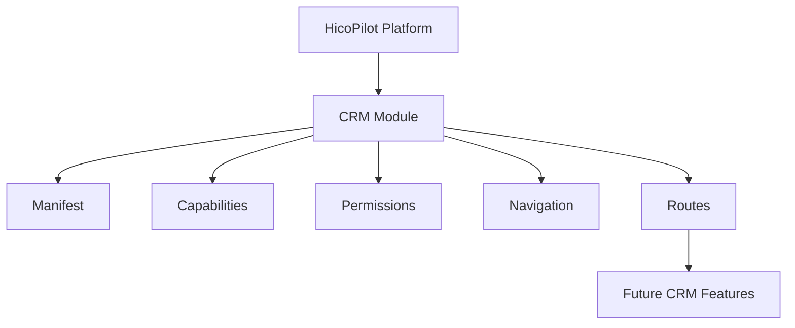

# SPR-301 — CRM Module Foundation

## Summary

SPR-301 starts Phase 3: Business Suite.

The CRM module is the first official HicoPilot business application built on top of the existing platform foundations. This sprint creates only the module skeleton and platform-facing contracts. It does not implement CRM CRUD, APIs, persistence, services or UI pages.

## Objective

Create the CRM module foundation and expose its metadata, manifest, capabilities, permissions, navigation and lazy-load-ready route definitions.

## Architecture

## Files Created

- `src/modules/index.ts`
- `src/modules/crm/index.ts`
- `src/modules/crm/crm.module.ts`
- `src/modules/crm/crm.manifest.ts`
- `src/modules/crm/crm.routes.ts`
- `src/modules/crm/crm.navigation.ts`
- `src/modules/crm/crm.permissions.ts`
- `src/modules/crm/crm.capabilities.ts`
- `src/modules/crm/crm.constants.ts`
- `src/modules/crm/crm.types.ts`
- `src/modules/crm/README.md`
- `docs/sprints/SPR-301.md`

## Files Modified

- `scripts/validate-runtime.cjs`
- `docs/02_PROJECT_STATUS.md`

## Public APIs

- `crmModule`
- `registerCrmModule()`
- `crmManifest`
- `crmCapabilities`
- `crmPermissions`
- `crmNavigation`
- `crmRoutes`

## Validation

- CRM module exposes stable module metadata.
- CRM manifest matches the module id.
- CRM capabilities include customer, company, contact, activity and note placeholders.
- CRM permissions are declarative only.
- CRM navigation exposes one top-level item and five child placeholders.
- CRM routes are lazy-load-ready placeholders.
- CRM foundation has no UI, runtime, permission engine, Prisma, API or React dependency.

## Known Risks

- The CRM module is not yet mounted in the visible app.
- No CRM services, persistence, APIs or pages exist yet.
- Permission definitions are declarative and are not wired into production RBAC yet.

## Future Work

- SPR-302 should create the CRM Customers Foundation.
- Later sprints should add CRM services, persistence, pages and platform registration flow.

## Release Notes

HicoPilot now has its first Business Suite module foundation, ready to serve as the blueprint for future business applications.
