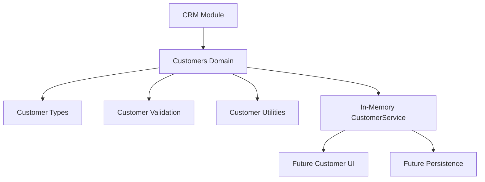

# SPR-302 — CRM Customers Foundation

## Objective

Create the Customer domain foundation inside the CRM module without adding UI, APIs, Prisma or database persistence.

## Scope

SPR-302 adds strongly typed customer models, validation helpers, utility functions and an in-memory `CustomerService` prepared for future persistence and UI screens.

## Files Created

- `src/modules/crm/customers/index.ts`
- `src/modules/crm/customers/customer.types.ts`
- `src/modules/crm/customers/customer.constants.ts`
- `src/modules/crm/customers/customer.utils.ts`
- `src/modules/crm/customers/customer.service.ts`
- `src/modules/crm/customers/customer.validation.ts`
- `src/modules/crm/customers/README.md`
- `docs/sprints/SPR-302.md`

## Files Modified

- `src/modules/crm/index.ts`
- `src/modules/crm/README.md`
- `scripts/validate-runtime.cjs`
- `docs/02_PROJECT_STATUS.md`

## Architecture Notes

The Customer domain is workspace-aware and permission-aware by accepting existing platform permission decisions. It does not implement a new permission engine.

## Validation Results

- Customer creation validates and normalizes input.
- Customer listing remains workspace-scoped.
- Invalid input returns structured validation issues.
- Permission-denied input blocks creation.
- Update, archive, search and sorting are covered by runtime validation.
- Customer foundation has no UI, Prisma, API or plugin runtime dependency.

## Risks

- Service state is in-memory only.
- No database persistence exists yet.
- No visible customer pages exist yet.
- Permission decisions are accepted, but production CRM RBAC integration remains future work.

## Next Suggested Sprint

SPR-303 — CRM Customers UI Foundation.
