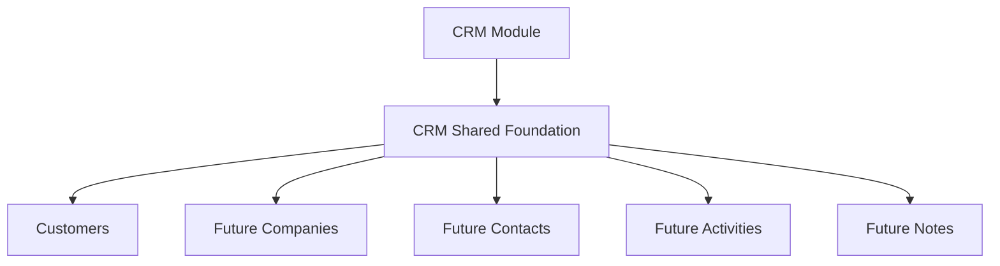

# SPR-303 — CRM Shared Foundation

## Objective

Create a reusable CRM shared foundation that future CRM domains can consume without duplicating infrastructure code.

## Architecture

## Files Created

- `src/modules/crm/shared/index.ts`
- `src/modules/crm/shared/crm-search.ts`
- `src/modules/crm/shared/crm-filters.ts`
- `src/modules/crm/shared/crm-pagination.ts`
- `src/modules/crm/shared/crm-sorting.ts`
- `src/modules/crm/shared/crm-errors.ts`
- `src/modules/crm/shared/crm-events.ts`
- `src/modules/crm/shared/crm-types.ts`
- `src/modules/crm/shared/crm-constants.ts`
- `src/modules/crm/shared/crm-utils.ts`
- `src/modules/crm/shared/crm-commands.ts`
- `src/modules/crm/shared/README.md`
- `docs/sprints/SPR-303.md`

## Files Modified

- `src/modules/crm/index.ts`
- `src/modules/crm/README.md`
- `scripts/validate-runtime.cjs`
- `docs/02_PROJECT_STATUS.md`

## Public APIs

- `CrmShared`
- `searchCrmEntities()`
- `matchesCrmSearch()`
- `filterCrmEntities()`
- `sortCrmEntities()`
- `paginateCrmItems()`
- `normalizeCrmPagination()`
- `crmErrors`
- `crmEventNames`
- `crmEventContracts`
- `createCrmCommand()`
- `normalizeCrmString()`
- `normalizeCrmTokens()`
- `normalizeCrmTags()`
- `createCrmDisplayLabel()`
- `areCrmValuesEqual()`

## Validation

- CRM shared search supports normalized multi-field ranking.
- CRM shared filters support workspace, status, owner, tags, archived and date criteria.
- CRM shared sorting is stable and supports multiple fields.
- CRM shared pagination exposes page and cursor-ready contracts.
- CRM shared errors, events and commands are typed immutable contracts.
- CRM shared foundation has no React, Prisma, API, platform runtime or UI dependency.

## Risks

- The shared layer is not yet widely consumed because most CRM domains are future modules.
- Search scoring is intentionally simple and may evolve when full CRM UI search is implemented.
- Pagination is cursor-ready but does not implement backend cursor persistence.

## Future Usage

Future CRM sprints should consume this shared foundation before adding domain-specific helpers.

## Release Notes

CRM now has a reusable shared infrastructure layer that prepares Customers, Companies, Contacts, Activities and Notes for consistent implementation.

