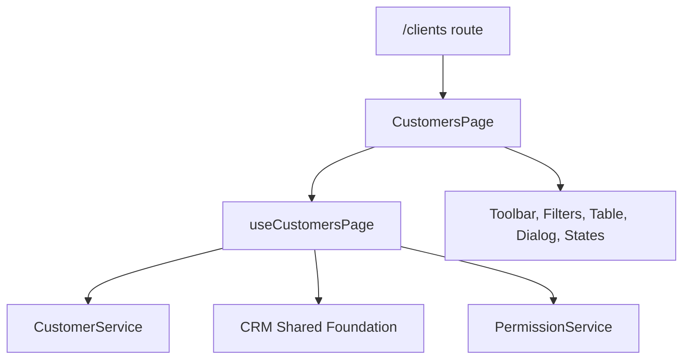

# SPR-304 — CRM Customers Professional UI Foundation

## Objective

Create the first visible professional CRM Customers page using the existing Customer Domain and CRM Shared Foundation.

## Architecture

## UI Structure

- `src/modules/crm/customers/ui/pages/`
- `src/modules/crm/customers/ui/hooks/`
- `src/modules/crm/customers/ui/tables/`
- `src/modules/crm/customers/ui/toolbar/`
- `src/modules/crm/customers/ui/filters/`
- `src/modules/crm/customers/ui/dialogs/`
- `src/modules/crm/customers/ui/components/`

## Components

- `CustomersPage`
- `useCustomersPage`
- `CustomersToolbar`
- `CustomersFilterSummary`
- `CustomersTable`
- `CustomerDialog`
- `CustomerStatCard`
- `CustomerStatusBadge`
- `CustomerEmptyState`
- `CustomerLoadingState`

## Files Created

- `src/modules/crm/customers/ui/customers.seed.ts`
- `src/modules/crm/customers/ui/index.ts`
- `src/modules/crm/customers/ui/pages/customers-page.tsx`
- `src/modules/crm/customers/ui/hooks/use-customers-page.ts`
- `src/modules/crm/customers/ui/tables/customers-table.tsx`
- `src/modules/crm/customers/ui/toolbar/customers-toolbar.tsx`
- `src/modules/crm/customers/ui/filters/customers-filter-summary.tsx`
- `src/modules/crm/customers/ui/dialogs/customer-dialog.tsx`
- `src/modules/crm/customers/ui/components/customer-stat-card.tsx`
- `src/modules/crm/customers/ui/components/customer-status-badge.tsx`
- `src/modules/crm/customers/ui/components/customer-empty-state.tsx`
- `src/modules/crm/customers/ui/components/customer-loading-state.tsx`
- `docs/sprints/SPR-304.md`

## Files Modified

- `src/app/(erp)/clients/page.tsx`
- `src/modules/crm/customers/index.ts`
- `src/modules/crm/customers/README.md`
- `docs/02_PROJECT_STATUS.md`

## Future Reuse

The page structure becomes the blueprint for future business module tables: Companies, Contacts, Products, Inventory and Invoices.

## Validation

- `npm run validate:runtime`
- `npm run typecheck`
- `npm run build`

## Risks

- Customer data remains in-memory.
- The add dialog persists only inside the current client session.
- View and Edit row actions are prepared as placeholders; Archive is connected to `CustomerService`.

