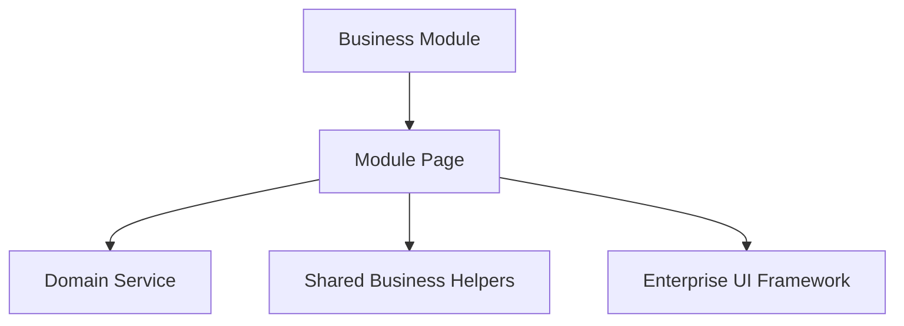

# SPR-305 — HicoPilot Enterprise UI Framework

## Objective

Extract reusable enterprise UI components from the CRM Customers page so future business modules can share one professional UI foundation.

## Architecture

## Component Hierarchy

- `src/ui/layout/`
  - `EntityPageLayout`
  - `EntityHeader`
- `src/ui/toolbar/`
  - `EntityToolbar`
  - `EntitySearchBar`
- `src/ui/filters/`
  - `EntityFilterPanel`
  - `EntityFilterSummary`
- `src/ui/tables/`
  - `EntityTable`
  - `EntityPagination`
  - `EntityActionMenu`
  - `EntityActionButton`
  - `EntityBulkActions`
- `src/ui/cards/`
  - `EntityStatsCards`
  - `MetricCard`
  - `InfoCard`
  - `SectionCard`
- `src/ui/dialogs/`
  - `EntityDialog`
- `src/ui/forms/`
  - `FormField`
  - `entityInputClassName`
- `src/ui/feedback/`
  - `EntityEmptyState`
  - `EntityLoadingState`
  - `EntityErrorState`
- `src/ui/hooks/`
  - `useEntitySelection`
- `src/ui/types/`
  - entity table, action and metric contracts

## Reuse Strategy

Business modules own data, domain services and actions. The Enterprise UI Framework renders reusable layout, table, toolbar, dialog and feedback primitives without owning business logic.

## Migration Strategy

The CRM Customers page now consumes the Enterprise UI Framework while preserving visible behavior. Future modules should compose these primitives before creating module-specific UI.

## Files Created

- `src/ui/`
- `docs/sprints/SPR-305.md`

## Files Modified

- `src/modules/crm/customers/ui/pages/customers-page.tsx`
- `src/modules/crm/customers/ui/tables/customers-table.tsx`
- `src/modules/crm/customers/ui/toolbar/customers-toolbar.tsx`
- `src/modules/crm/customers/ui/dialogs/customer-dialog.tsx`
- `src/modules/crm/customers/ui/filters/customers-filter-summary.tsx`
- `src/modules/crm/customers/ui/components/customer-empty-state.tsx`
- `src/modules/crm/customers/ui/components/customer-loading-state.tsx`
- `src/modules/crm/customers/ui/components/customer-stat-card.tsx`
- `docs/02_PROJECT_STATUS.md`

## Validation

- `npm run validate:runtime`
- `npm run typecheck`
- `npm run build`

## Risks

- The framework is intentionally presentation-only.
- Additional modules may require new primitives as real use cases appear.
- Inline editing and virtualization are prepared conceptually but not implemented yet.

