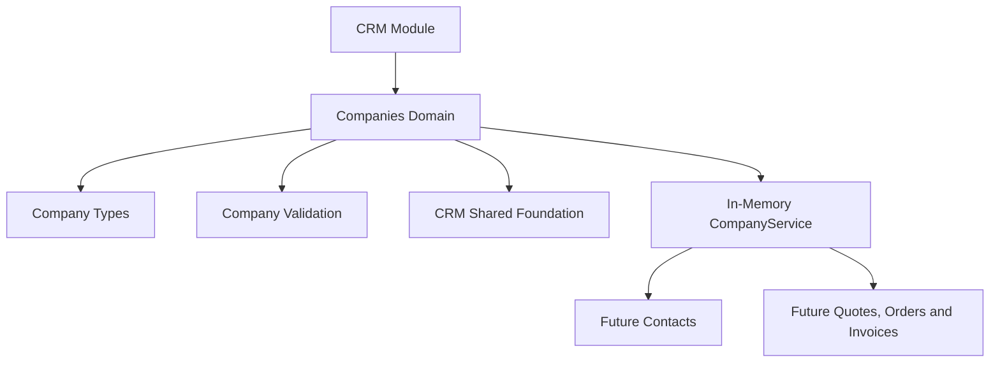

# SPR-306 — CRM Companies Foundation

## Objective

Create the CRM Company Domain Foundation without adding UI, APIs, Prisma or database persistence.

## Architecture

## Domain Model

The `Company` model includes identity, registration, tax, industry, website, contact, address, status, tags, notes, ownership, workspace and audit metadata.

## Files Created

- `src/modules/crm/companies/index.ts`
- `src/modules/crm/companies/company.types.ts`
- `src/modules/crm/companies/company.constants.ts`
- `src/modules/crm/companies/company.validation.ts`
- `src/modules/crm/companies/company.utils.ts`
- `src/modules/crm/companies/company.service.ts`
- `src/modules/crm/companies/README.md`
- `docs/sprints/SPR-306.md`

## Files Modified

- `src/modules/crm/index.ts`
- `src/modules/crm/README.md`
- `scripts/validate-runtime.cjs`
- `docs/02_PROJECT_STATUS.md`

## Future Relationships

Future CRM domains should reference `CompanyId`:

- Contacts
- Opportunities
- Quotes
- Orders
- Invoices
- Activities
- Notes

## Workspace Awareness

`CompanyService` requires `workspaceId` for list, lookup, search, create, update and archive operations. It never returns companies from another workspace.

## Permission Awareness

The Companies domain accepts existing platform permission decisions. It does not implement or duplicate permission logic.

## Validation

- Company creation validates and normalizes input.
- Company listing remains workspace-scoped.
- Invalid input returns structured validation issues.
- Permission-denied input blocks creation.
- Update, archive, search, filtering and sorting are covered by runtime validation.
- Company foundation has no UI, Prisma, API or plugin runtime dependency.

## Risks

- Service state is in-memory only.
- No database persistence exists yet.
- No visible company pages exist yet.
- Production CRM RBAC integration remains future work.

## Next Suggested Sprint

SPR-307 — CRM Companies Professional UI.

