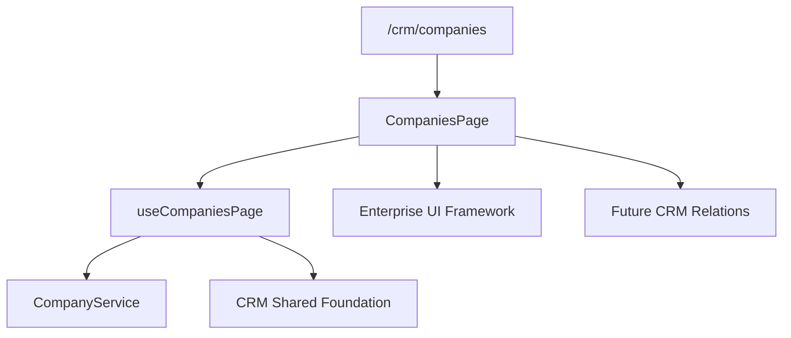

# SPR-307 — CRM Companies Professional Workspace

## Objective

Create the professional Companies workspace as the central CRM area for future Contacts, Opportunities, Quotes, Orders, Projects and Invoices.

## Architecture

## Workspace Philosophy

Company is the central CRM entity. The workspace is designed to become the place where future contacts, opportunities, sales documents, projects and billing activity connect.

## Reuse Strategy

The page consumes `src/ui/` for layout, header, toolbar, filters, table, pagination, dialog, cards and feedback states. Business rules remain inside the Company domain and CRM Shared Foundation.

## Future Module Integration

The workspace includes non-functional placeholders for:

- Contacts
- Customers
- Projects
- Invoices
- Opportunities
- Quotes
- Orders

## Files Created

- `src/modules/crm/companies/ui/`
- `src/app/(erp)/crm/companies/page.tsx`
- `docs/sprints/SPR-307.md`

## Files Modified

- `src/modules/crm/companies/index.ts`
- `src/modules/crm/companies/README.md`
- `docs/02_PROJECT_STATUS.md`

## Validation

- `npm run validate:runtime`
- `npm run typecheck`
- `npm run build`

## Risks

- Companies remain in-memory only.
- The route is available at `/crm/companies`, but navigation exposure remains a future integration concern.
- Future relation placeholders are visual only.

