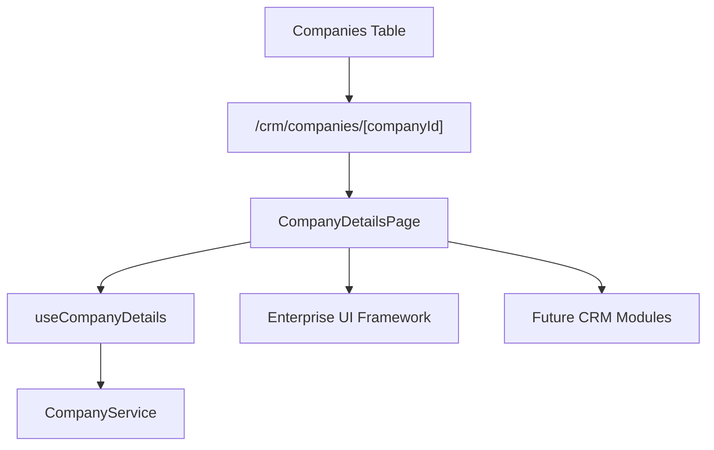

# SPR-308 — Company Details Workspace

## Summary

SPR-308 adds the professional Company Details Workspace. Companies are no longer only rows in a list; each company now has a central workspace prepared for future CRM, Sales, Projects and Billing integrations.

## Objective

Create a details page opened from the Companies table `View` action without adding Contacts, Opportunities, Projects, APIs, Prisma or backend persistence.

## Architecture

## Workspace Philosophy

Company is the central CRM entity. The details workspace is prepared so future modules can attach their records and context to a single company surface instead of creating disconnected pages.

## Tabs

- Overview
- Contacts
- Customers
- Sales
- Projects
- Invoices
- Activity
- Notes
- Settings

Only `Overview` displays current company data. Other tabs are explicit future-module placeholders.

## Navigation

The `View` action in the Companies table opens `/crm/companies/[companyId]`.

## Files Created

- `src/app/(erp)/crm/companies/[companyId]/page.tsx`
- `src/modules/crm/companies/ui/details/`
- `docs/sprints/SPR-308.md`

## Files Modified

- `src/modules/crm/companies/ui/index.ts`
- `src/modules/crm/companies/ui/tables/companies-table.tsx`
- `src/modules/crm/companies/README.md`
- `docs/02_PROJECT_STATUS.md`

## Public APIs

- `CompanyDetailsPage`

## Validation

- `npm run validate:runtime`
- `npm run typecheck`
- `npm run build`

## Known Risks

- Details data is still in-memory demo data.
- Future tabs and inspector panels are placeholders only.
- Companies created in the list are not persisted across reloads.

## Future Work

- SPR-309 should introduce CRM Contacts Foundation or connect details workspaces to the next CRM domain.

## Release Notes

Added a professional company detail workspace with overview, tabs, summary placeholders and inspector panel.
