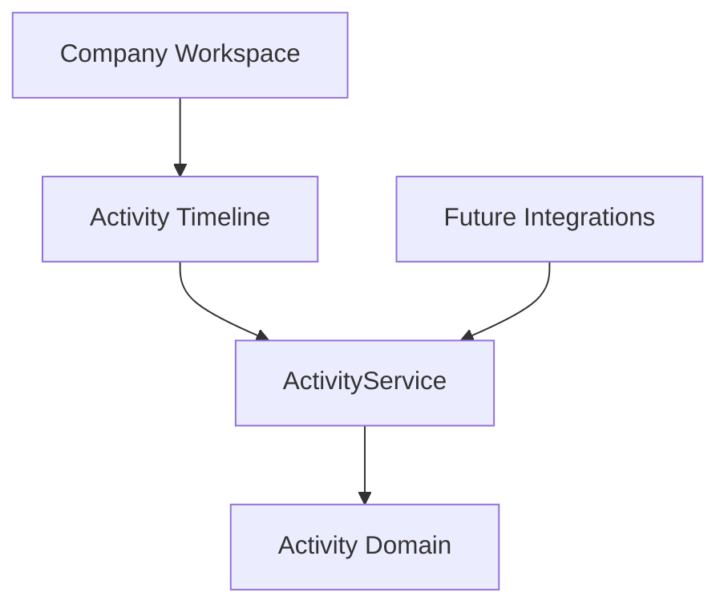

# SPR-313 — CRM Activities & Timeline Foundation

## Summary

SPR-313 creates the CRM Activity domain and replaces the Company Workspace mock timeline with an ActivityService-backed timeline.

## Objective

Build CRM historical memory for Companies and Contacts using in-memory storage only.

## Activity Architecture

## Domain Model

Activities include:

- workspace scope
- company relationship
- optional contact relationship
- type
- title and description
- performed user and date
- status
- priority
- tags
- metadata
- created and updated timestamps

## Timeline Philosophy

The timeline is CRM memory. It should eventually capture emails, meetings, sales actions, invoices, projects, workflows and AI suggestions.

The Company Timeline now reads from `ActivityService` instead of static component mock data.

## Future Event Integrations

Future modules can create activities for:

- Emails
- Meetings
- Sales
- Invoices
- Projects
- Workflow
- AI

## Files Created

- `src/modules/crm/activities/activity.types.ts`
- `src/modules/crm/activities/activity.constants.ts`
- `src/modules/crm/activities/activity.validation.ts`
- `src/modules/crm/activities/activity.utils.ts`
- `src/modules/crm/activities/activity.service.ts`
- `src/modules/crm/activities/index.ts`
- `src/modules/crm/activities/README.md`
- `src/modules/crm/activities/ui/activities.seed.ts`
- `src/modules/crm/activities/ui/company-activity-timeline.tsx`
- `docs/sprints/SPR-313.md`

## Files Modified

- `src/modules/crm/index.ts`
- `src/modules/crm/companies/ui/details/pages/company-details-page.tsx`
- `scripts/validate-runtime.cjs`
- `docs/02_PROJECT_STATUS.md`

## Public APIs

- `ActivityService`
- `activityService`
- `validateCreateActivityInput()`
- `validateUpdateActivityInput()`
- `filterActivities()`
- `matchesActivitySearch()`
- `sortActivities()`
- `CompanyActivityTimeline`

## Validation

- `npm run validate:runtime`
- `npm run typecheck`
- `npm run build`

## Known Risks

- Activities are in-memory only.
- Timeline filters are local UI state only.
- Future integrations do not yet emit activities automatically.

## Future Work

- Connect activity creation from Contacts, Emails, Meetings, Sales and AI workflows.
- Add a create activity dialog when business workflow requirements are defined.

## Release Notes

CRM now includes its first business history layer and Company Timeline is backed by ActivityService.
