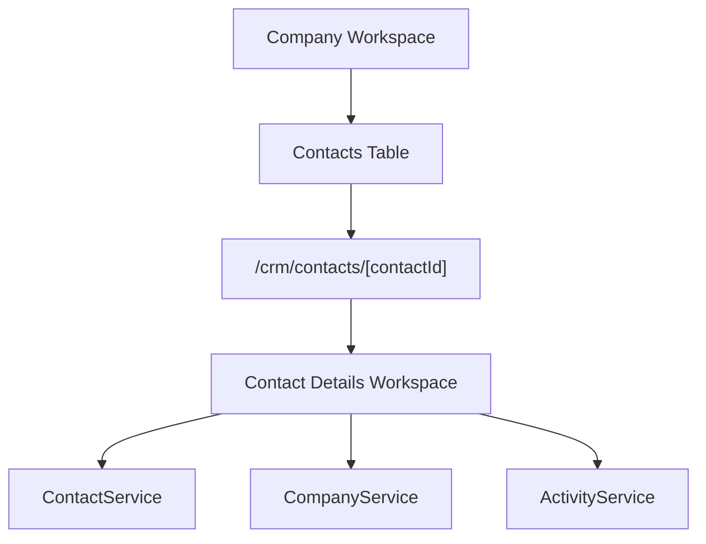

# SPR-314 — CRM Contact Details Workspace

## Summary

SPR-314 creates the first professional Contact Details Workspace in CRM. Contacts now have a dedicated page under `/crm/contacts/[contactId]`, linked from the Company Contacts table.

## Objective

Transform contacts from table rows into business workspaces while keeping CRM logic inside existing services and domain foundations.

## Architecture

## Files Created

- `src/app/(erp)/crm/contacts/[contactId]/page.tsx`
- `src/modules/crm/contacts/ui/details/index.ts`
- `src/modules/crm/contacts/ui/details/hooks/use-contact-details.ts`
- `src/modules/crm/contacts/ui/details/pages/contact-details-page.tsx`
- `src/modules/crm/contacts/ui/details/components/contact-details-header.tsx`
- `src/modules/crm/contacts/ui/details/components/contact-details-tabs.tsx`
- `src/modules/crm/contacts/ui/details/components/contact-summary-cards.tsx`
- `src/modules/crm/contacts/ui/details/components/contact-overview.tsx`
- `src/modules/crm/contacts/ui/details/components/contact-inspector-panel.tsx`
- `src/modules/crm/contacts/ui/details/components/contact-placeholder-tab.tsx`
- `src/modules/crm/contacts/ui/details/widgets/contact-activities-panel.tsx`

## Files Modified

- `docs/02_PROJECT_STATUS.md`
- `docs/sprints/SPR-314.md`
- `src/modules/crm/contacts/ui/index.ts`
- `src/modules/crm/contacts/ui/tables/contacts-table.tsx`
- `src/modules/crm/crm.routes.ts`
- `src/modules/crm/crm.types.ts`

## Public APIs

- `ContactDetailsPage`
- `useContactDetails`
- `/crm/contacts/[contactId]`

## Workspace Behavior

- Header displays avatar, role, department, company and status.
- Summary cards display activity-oriented contact metrics.
- Overview tab displays personal, professional, communication and localization details.
- Activities tab displays contact-scoped activities from `ActivityService`.
- Other tabs are prepared as professional placeholders for Meetings, Emails, Notes, Documents and Settings.
- Inspector panel shows company, owner, status, timestamps and future quick links.

## Validation

- `npm run validate:runtime`
- `npm run typecheck`
- `npm run build`

## Known Risks

- Data remains seeded and in-memory.
- Meetings, emails, notes and documents are placeholders only.
- Activity creation is not yet connected to real business event emission.

## Future Work

SPR-315 should introduce the Meetings Foundation or the next connected CRM interaction layer that can attach naturally to Contact and Company workspaces.

## Release Notes

CRM now supports a dedicated Contact Details Workspace and natural Company to Contact navigation.
