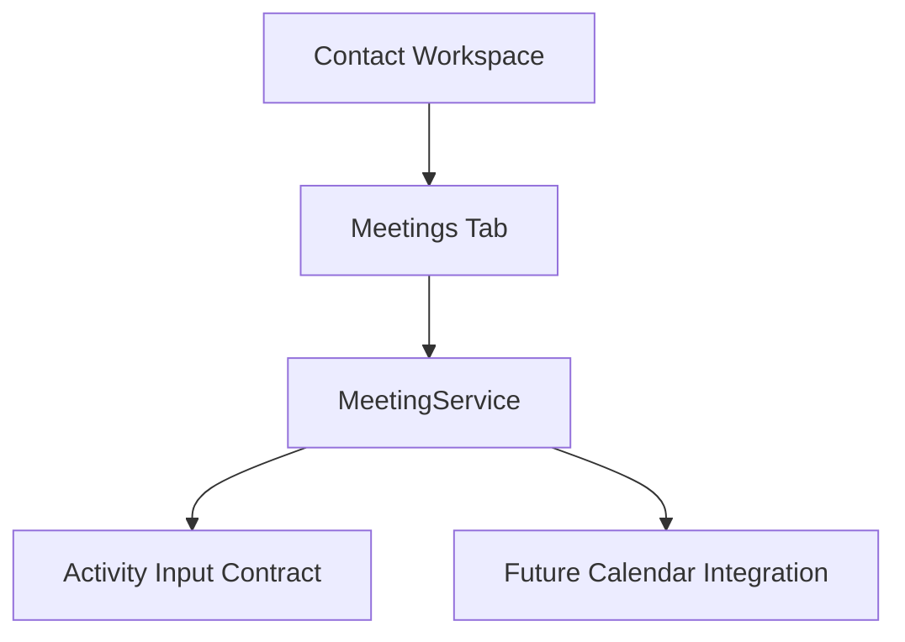

# SPR-315 — CRM Meetings Foundation

## Summary

SPR-315 introduces the CRM Meetings Foundation and enables the Meetings tab inside the Contact Workspace.

## Objective

Create a complete in-memory Meeting domain where every meeting belongs to one company and one or more contacts. Meetings prepare Activity entries using existing Activity contracts.

## Architecture

## Files Created

- `src/modules/crm/meetings/meeting.types.ts`
- `src/modules/crm/meetings/meeting.constants.ts`
- `src/modules/crm/meetings/meeting.validation.ts`
- `src/modules/crm/meetings/meeting.utils.ts`
- `src/modules/crm/meetings/meeting.service.ts`
- `src/modules/crm/meetings/index.ts`
- `src/modules/crm/meetings/README.md`
- `src/modules/crm/meetings/ui/meetings.seed.ts`
- `src/modules/crm/meetings/ui/contact-meetings-panel.tsx`

## Files Modified

- `docs/02_PROJECT_STATUS.md`
- `docs/sprints/SPR-315.md`
- `scripts/validate-runtime.cjs`
- `src/modules/crm/crm.capabilities.ts`
- `src/modules/crm/crm.manifest.ts`
- `src/modules/crm/crm.permissions.ts`
- `src/modules/crm/index.ts`
- `src/modules/crm/contacts/ui/details/hooks/use-contact-details.ts`
- `src/modules/crm/contacts/ui/details/pages/contact-details-page.tsx`

## Public APIs

- `Meeting`
- `MeetingService`
- `CreateMeetingInput`
- `UpdateMeetingInput`
- `MeetingFilters`
- `MeetingSearchQuery`
- `prepareMeetingActivityInput()`

## Meeting Architecture

Meetings are pure TypeScript domain objects. The domain is workspace-aware, company-aware, contact-aware and permission-aware. It does not use React, Prisma, API routes, backend services or persistence.

## Company Relationship

Each meeting belongs to exactly one `companyId`.

## Contact Relationship

Each meeting references one or more `contactIds`. The Contact Workspace filters meetings by selected contact.

## Activity Integration

`MeetingService.createMeeting()` prepares an Activity input through `prepareMeetingActivityInput()`. This keeps ActivityService unchanged while creating a safe integration point for future automatic timelines.

## Future Calendar Integration

The model already contains `startAt`, `endAt`, `location`, `participants`, status and meeting type. These fields are ready for future Calendar, Tasks, Emails and AI summary features.

## Validation

- `npm run validate:runtime`
- `npm run typecheck`
- `npm run build`

## Known Risks

- Meetings are in-memory only.
- Contact Workspace meeting creation UI is not implemented yet.
- Calendar synchronization is not implemented.
- Activity creation is prepared through a contract but not persisted beyond the optional in-memory callback.

## Future Work

SPR-316 should introduce CRM Notes Foundation or a Meeting creation workflow depending on product priority.

## Release Notes

The Contact Workspace now has a functional Meetings tab backed by the new Meeting domain.
