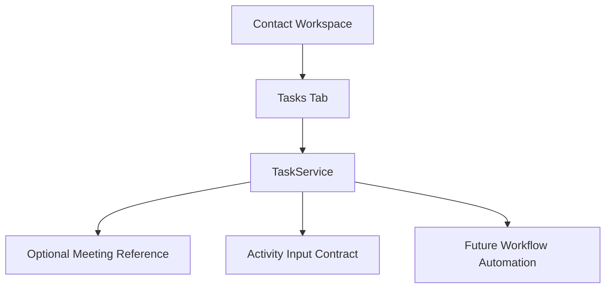

# SPR-316 — CRM Tasks Foundation

## Summary

SPR-316 introduces the CRM Tasks Foundation and enables the Tasks tab inside the Contact Workspace.

## Objective

Create a complete in-memory Task domain where every task belongs to one company and one contact, and may optionally belong to one meeting. Tasks prepare Activity entries when created, completed or cancelled.

## Architecture

## Files Created

- `src/modules/crm/tasks/task.types.ts`
- `src/modules/crm/tasks/task.constants.ts`
- `src/modules/crm/tasks/task.validation.ts`
- `src/modules/crm/tasks/task.utils.ts`
- `src/modules/crm/tasks/task.service.ts`
- `src/modules/crm/tasks/index.ts`
- `src/modules/crm/tasks/README.md`
- `src/modules/crm/tasks/ui/tasks.seed.ts`
- `src/modules/crm/tasks/ui/contact-tasks-panel.tsx`

## Files Modified

- `docs/02_PROJECT_STATUS.md`
- `docs/sprints/SPR-316.md`
- `scripts/validate-runtime.cjs`
- `src/modules/crm/crm.capabilities.ts`
- `src/modules/crm/crm.manifest.ts`
- `src/modules/crm/crm.permissions.ts`
- `src/modules/crm/index.ts`
- `src/modules/crm/contacts/ui/details/components/contact-details-tabs.tsx`
- `src/modules/crm/contacts/ui/details/hooks/use-contact-details.ts`
- `src/modules/crm/contacts/ui/details/pages/contact-details-page.tsx`

## Public APIs

- `Task`
- `TaskService`
- `CreateTaskInput`
- `UpdateTaskInput`
- `TaskFilters`
- `TaskSearchQuery`
- `prepareTaskActivityInput()`
- `createFollowUpTaskFromMeeting()`

## Task Architecture

Tasks are pure TypeScript domain objects. The domain is workspace-aware, company-aware, contact-aware, meeting-aware and permission-aware. It does not use React, Prisma, API routes, backend services or persistence.

## Meeting Relationship

Tasks can reference `meetingId`, enabling future meeting follow-up workflows without modifying `MeetingService`.

## Contact Relationship

Every task belongs to exactly one contact. The Contact Workspace filters tasks by the selected contact.

## Activity Integration

`TaskService.createTask()`, `completeTask()` and `cancelTask()` prepare Activity inputs through existing Activity contracts. `ActivityService` remains unchanged.

## Future Workflow Integration

The model is ready for workflow automation, reminders, AI follow-up suggestions, SLA tracking and team assignment.

## Validation

- `npm run validate:runtime`
- `npm run typecheck`
- `npm run build`

## Known Risks

- Tasks are in-memory only.
- Contact Workspace task creation UI is not implemented yet.
- Workflow automation and reminders are not implemented.
- Activity entries are prepared through contracts and optional callbacks only.

## Future Work

SPR-317 should introduce CRM Notes Foundation or a Task creation workflow depending on product priority.

## Release Notes

The Contact Workspace now has a functional Tasks tab backed by the new Task domain.
