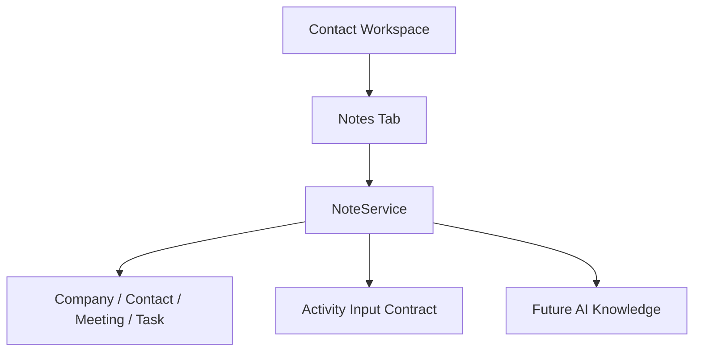

# SPR-317 — CRM Notes Foundation

## Summary

SPR-317 introduces the CRM Notes Foundation and enables the Notes tab inside the Contact Workspace.

## Objective

Create a complete in-memory Note domain where notes enrich companies, contacts, meetings and tasks. Notes prepare Activity entries when created, updated or archived.

## Architecture

## Files Created

- `src/modules/crm/notes/note.types.ts`
- `src/modules/crm/notes/note.constants.ts`
- `src/modules/crm/notes/note.validation.ts`
- `src/modules/crm/notes/note.utils.ts`
- `src/modules/crm/notes/note.service.ts`
- `src/modules/crm/notes/index.ts`
- `src/modules/crm/notes/README.md`
- `src/modules/crm/notes/ui/notes.seed.ts`
- `src/modules/crm/notes/ui/contact-notes-panel.tsx`

## Files Modified

- `docs/02_PROJECT_STATUS.md`
- `docs/sprints/SPR-317.md`
- `scripts/validate-runtime.cjs`
- `src/modules/crm/index.ts`
- `src/modules/crm/contacts/ui/details/hooks/use-contact-details.ts`
- `src/modules/crm/contacts/ui/details/pages/contact-details-page.tsx`

## Public APIs

- `Note`
- `NoteService`
- `CreateNoteInput`
- `UpdateNoteInput`
- `NoteFilters`
- `NoteSearchQuery`
- `prepareNoteActivityInput()`
- `createNoteExcerpt()`
- `isPinnedNote()`

## Note Architecture

Notes are pure TypeScript domain objects. The domain is workspace-aware, company-aware, contact-aware, meeting-aware, task-aware and permission-aware. It does not use React, Prisma, API routes, backend services or persistence.

## Relationships

Every note belongs to a company. Notes may also reference a contact, meeting or task, which prepares the CRM for contextual knowledge surfaces without duplicating note logic.

## Activity Integration

`NoteService.createNote()`, `updateNote()` and `archiveNote()` prepare Activity inputs through existing Activity contracts. `ActivityService` remains unchanged.

## Future AI Usage

Notes are designed as a future AI knowledge source. The model includes visibility, author, tags, relationship scope and attachment placeholders so future AI features can respect permissions and workspace context.

## Validation

- `npm run validate:runtime`
- `npm run typecheck`
- `npm run build`

## Known Risks

- Notes are in-memory only.
- Contact Workspace note creation UI is not implemented yet.
- Company Workspace note integration is prepared but not implemented.
- AI indexing and summarization are not implemented.

## Future Work

SPR-318 should integrate Notes into the Company Workspace or introduce a Notes creation workflow depending on product priority.

## Release Notes

The Contact Workspace now has a functional Notes tab backed by the new Note domain.
