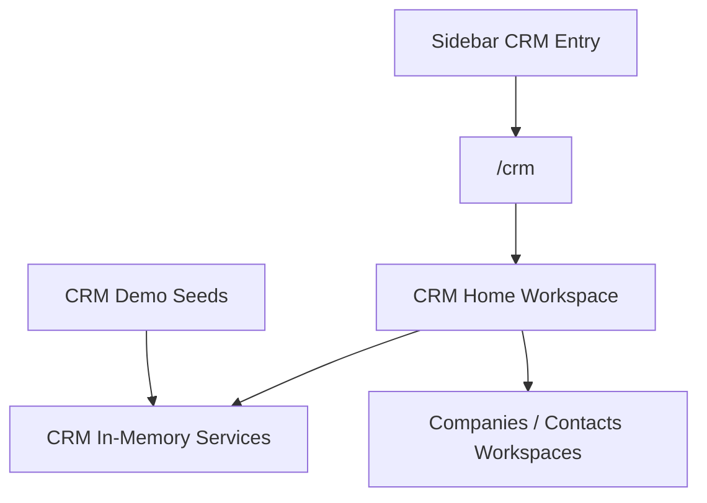

# SPR-318 — CRM Home Workspace

## Summary

SPR-318 creates the first dedicated CRM Home Workspace at `/crm`.

The CRM sidebar entry no longer opens the generic ERP module fallback. Users now see a professional French CRM landing page that explains the available CRM domains and guides them toward Companies, Customers, Contacts, Meetings, Tasks and Notes.

## Objective

Replace the generic CRM entry experience with a real product workspace while preserving the existing CRM architecture, routes, services and in-memory foundations.

## Architecture



## Files Created

| File | Purpose |
| --- | --- |
| `src/app/(erp)/crm/page.tsx` | Registers the real `/crm` route. |
| `src/modules/crm/home/index.ts` | Public export for the CRM Home module. |
| `src/modules/crm/home/crm-home-page.tsx` | Professional CRM Home Workspace UI. |
| `docs/sprints/SPR-318.md` | Sprint documentation. |

## Files Modified

| File | Purpose |
| --- | --- |
| `src/modules/crm/index.ts` | Exposes the CRM Home module export. |
| `docs/02_PROJECT_STATUS.md` | Marks the CRM Home Workspace and UX fix status. |

## CRM Home Workspace Design

The page uses French labels only and presents:

- CRM header with workspace and status badges.
- Quick actions for société, contact, réunion, tâche and note.
- KPI cards for sociétés, contacts, réunions, tâches ouvertes, notes and activités.
- Recent CRM activity.
- Upcoming meetings.
- Open tasks.
- Recent notes.
- Recently added companies.
- Contacts overview.
- Guided navigation explaining where nested CRM concepts live.

## Navigation Changes

No Sidebar redesign was required. The existing CRM sidebar entry now resolves to a real `/crm` route instead of falling back to the generic module page.

Nested CRM concepts remain contextual:

- Contacts are accessed through Companies.
- Activities and Timeline are accessed through Companies.
- Meetings, Tasks and Notes are accessed through Contacts.

## UX Decisions

- The page avoids generic labels such as `MODULE ERP`, `Module` and `Nouvelle entrée`.
- CRM Home communicates what the CRM contains and what the user can do next.
- Demo values are derived from existing CRM seeds and in-memory services.
- Quick actions guide users to the correct existing workspace instead of creating fake standalone pages.

## Future i18n Note

SPR-318 does not introduce a full localization system. It keeps all visible CRM Home copy consistently French and leaves project-wide i18n for a future dedicated sprint.

## Validation

Run:

```bash
npm run validate:runtime
npm run typecheck
npm run build
```

## Known Risks

- CRM Home uses demo seeded data and in-memory services.
- Quick actions route users to the correct contextual workspace but do not open persistence-backed creation flows.
- Some CRM sidebar labels remain inherited from the previous navigation sprint and can be localized in a future navigation polish sprint.

## Future Work

- Add real workspace-aware persisted CRM data.
- Connect quick actions to contextual create dialogs.
- Localize the CRM sidebar labels consistently.
- Introduce CRM-level activity, notes and meeting aggregation once persistence exists.
