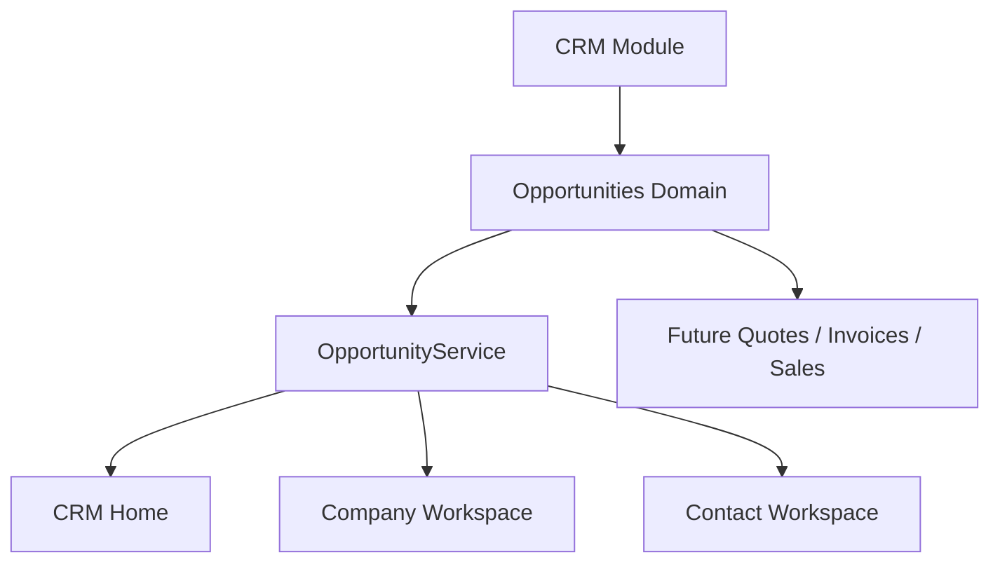

# SPR-319 — Sales Opportunities Foundation

## Summary

SPR-319 starts Phase 4 — Sales Engine by adding the Sales Opportunities domain and making the first sales pipeline concept visible in the CRM product experience.

## Objective

Implement a pure TypeScript Opportunity domain and improve discoverability from CRM Home, Company Workspace and Contact Workspace without creating APIs, Prisma persistence or standalone opportunity pages.

## Architecture



## Files Created

| File | Purpose |
| --- | --- |
| `src/modules/crm/opportunities/opportunity.types.ts` | Strong Opportunity domain model and input/filter/sort types. |
| `src/modules/crm/opportunities/opportunity.constants.ts` | Pipeline stages, statuses, priorities and labels. |
| `src/modules/crm/opportunities/opportunity.validation.ts` | Structured validation helpers. |
| `src/modules/crm/opportunities/opportunity.utils.ts` | Normalization, filtering, search, sorting and activity preparation. |
| `src/modules/crm/opportunities/opportunity.service.ts` | In-memory workspace-aware OpportunityService. |
| `src/modules/crm/opportunities/index.ts` | Public Opportunity domain exports. |
| `src/modules/crm/opportunities/README.md` | Domain documentation. |
| `src/modules/crm/opportunities/ui/opportunities.seed.ts` | Demo opportunities for visible CRM surfaces. |
| `src/modules/crm/opportunities/ui/company-opportunities-panel.tsx` | Company Workspace opportunity entry point. |
| `src/modules/crm/opportunities/ui/contact-opportunities-panel.tsx` | Contact Workspace opportunity entry point. |
| `docs/sprints/SPR-319.md` | Sprint documentation. |

## Files Modified

| File | Purpose |
| --- | --- |
| `src/modules/crm/index.ts` | Exposes the Opportunities domain. |
| `src/modules/crm/crm.capabilities.ts` | Adds `crm.opportunity.read/write` capabilities. |
| `src/modules/crm/crm.permissions.ts` | Adds `crm.opportunity.read/write` permissions. |
| `src/modules/crm/crm.manifest.ts` | Describes opportunities in the CRM manifest. |
| `src/modules/crm/home/crm-home-page.tsx` | Adds Opportunities KPI and pipeline section. |
| `src/modules/crm/companies/ui/details/*` | Adds the Company Opportunities tab and improves French wording. |
| `src/modules/crm/contacts/ui/details/*` | Adds the Contact Opportunities entry and improves French wording. |
| `scripts/validate-runtime.cjs` | Adds Opportunity foundation validation. |
| `docs/02_PROJECT_STATUS.md` | Updates project status and UX notes. |

## Opportunity Architecture

An Opportunity belongs to:

- Workspace
- Company
- Primary Contact

It supports:

- Pipeline stages: Lead, Qualified, Proposal, Negotiation, Won, Lost
- Probability
- Estimated value
- Expected close date
- Owner
- Status
- Priority
- Tags

## UX Improvements

- CRM Home now displays Opportunities and pipeline value.
- Company Workspace exposes a dedicated `Opportunités` tab.
- Contact Workspace exposes a lightweight `Opportunités` section and tab.
- Several CRM workspace labels were improved from generic English copy to French product wording.
- Empty states explain where future sales workflow actions will live.

## Validation

Run:

```bash
npm run validate:runtime
npm run typecheck
npm run build
```

## Risks

- Opportunity data is demo/in-memory only.
- Opportunity UI is intentionally lightweight and not a full pipeline board.
- Activity preparation exists but no backend persistence is implemented.

## Future Work

- SPR-320 — Opportunities Pipeline Workspace.
- Add create/edit/archive opportunity UI.
- Connect opportunities to Quotes, Invoices and Orders.
- Persist opportunities through the future CRM persistence layer.
