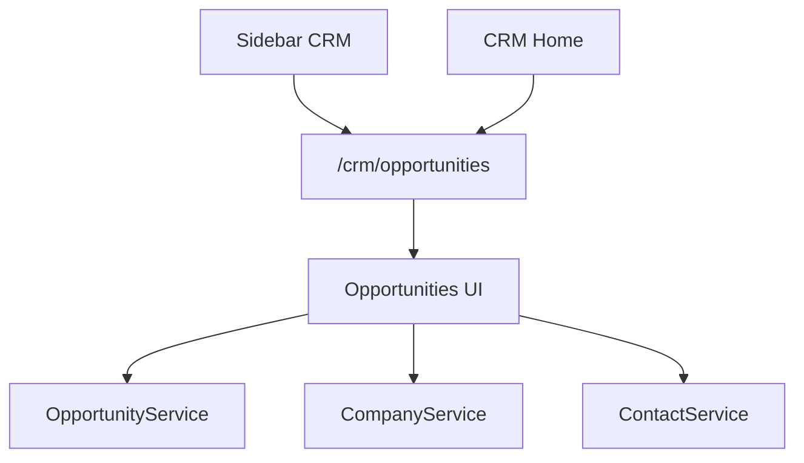

# SPR-320 — Sales Pipeline Workspace

## Summary

SPR-320 transforms CRM Opportunities into a visible sales pipeline workspace. The sprint adds a professional `/crm/opportunities` page, exposes the pipeline from CRM Home and Sidebar navigation, and keeps Opportunity business logic inside the existing in-memory domain service.

## Objective

Create a premium, French-first Sales Pipeline experience for managing opportunities visually without redesigning the platform, runtime, CRM architecture, Prisma or APIs.

## Architecture

The workspace consumes existing seeded services and UI primitives. It does not introduce persistence, APIs, runtime changes or new business rules.

## Files Created

- `src/app/(erp)/crm/opportunities/page.tsx`
- `src/modules/crm/opportunities/ui/index.ts`
- `src/modules/crm/opportunities/ui/opportunities-workspace.tsx`

## Files Modified

- `src/modules/crm/crm.navigation.ts`
- `src/modules/crm/crm.routes.ts`
- `src/modules/crm/crm.types.ts`
- `src/modules/crm/home/crm-home-page.tsx`
- `src/modules/crm/opportunities/ui/company-opportunities-panel.tsx`
- `src/modules/crm/opportunities/ui/contact-opportunities-panel.tsx`
- `src/modules/crm/opportunities/ui/opportunities.seed.ts`
- `src/services/navigation/sidebar-adapter.ts`
- `scripts/validate-runtime.cjs`
- `docs/02_PROJECT_STATUS.md`

## Public APIs

- `OpportunitiesWorkspace`
- CRM route metadata for `crm.opportunities`
- CRM navigation entry for `Opportunités`

## Validation

- `npm run validate:runtime`
- `npm run typecheck`
- `npm run build`

## Known Risks

- Pipeline data remains in-memory/demo only.
- Drag and drop is visually prepared but not implemented.
- Opportunity creation still routes through company context until a dedicated opportunity creation flow exists.

## Future Work

- SPR-321 should create the Opportunity Details Workspace.
- Future sprints should connect stage movement, creation dialogs, activity emission and persistence.

## Release Notes

- Added a professional visual sales pipeline at `/crm/opportunities`.
- Added CRM Sidebar access for `Opportunités`.
- Added CRM Home quick access and pipeline summary.
- Localized visible opportunity workspace labels in French.
