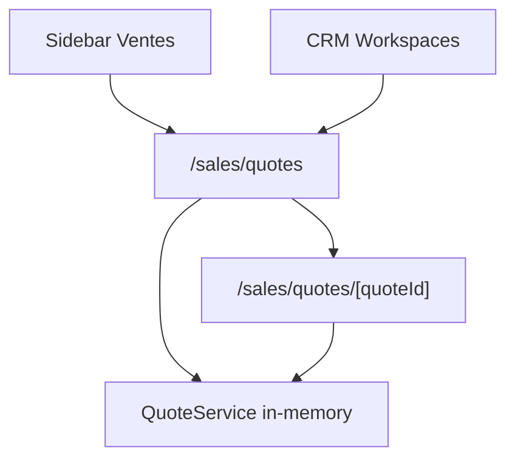

# SPR-321 — Quotes Workspace

## Summary

SPR-321 creates the Sales Quotes Workspace and connects it to the existing CRM experience. Users can navigate to `/sales/quotes`, browse quotes, create an in-memory demo quote, and open quote details.

## Objective

Build a visible, French-first commercial quotes experience integrated with CRM companies, contacts and opportunities without adding backend, Prisma, APIs or runtime changes.

## Architecture

## Files Created

- `src/app/(erp)/sales/quotes/page.tsx`
- `src/app/(erp)/sales/quotes/[quoteId]/page.tsx`
- `src/modules/sales/index.ts`
- `src/modules/sales/quotes/index.ts`
- `src/modules/sales/quotes/quote.constants.ts`
- `src/modules/sales/quotes/quote.service.ts`
- `src/modules/sales/quotes/quote.types.ts`
- `src/modules/sales/quotes/quote.utils.ts`
- `src/modules/sales/quotes/quotes.seed.ts`
- `src/modules/sales/quotes/ui/index.ts`
- `src/modules/sales/quotes/ui/quote-details-workspace.tsx`
- `src/modules/sales/quotes/ui/quote-panels.tsx`
- `src/modules/sales/quotes/ui/quotes-workspace.tsx`

## Files Modified

- `src/modules/index.ts`
- `src/services/navigation/sidebar-adapter.ts`
- `src/modules/crm/home/crm-home-page.tsx`
- `src/modules/crm/opportunities/ui/opportunities-workspace.tsx`
- `src/modules/crm/opportunities/ui/company-opportunities-panel.tsx`
- `src/modules/crm/companies/ui/details/components/company-details-tabs.tsx`
- `src/modules/crm/companies/ui/details/hooks/use-company-details.ts`
- `src/modules/crm/companies/ui/details/pages/company-details-page.tsx`
- `src/modules/crm/contacts/ui/details/components/contact-details-tabs.tsx`
- `src/modules/crm/contacts/ui/details/hooks/use-contact-details.ts`
- `src/modules/crm/contacts/ui/details/pages/contact-details-page.tsx`
- `docs/02_PROJECT_STATUS.md`

## Public APIs

- `QuoteService`
- `Quote`
- `QuoteStatus`
- `calculateQuoteTotals()`
- `getQuoteTotals()`
- `formatQuoteMoney()`
- `QuotesWorkspace`
- `QuoteDetailsWorkspace`
- `CompanyQuotesPanel`
- `ContactQuotesPanel`
- `OpportunityQuoteAction`

## Validation

- `npm run validate:runtime`
- `npm run typecheck`
- `npm run build`

## Known Risks

- Quotes are in-memory only.
- The create dialog uses a professional demo structure and creates a seeded-style quote, not a full editable quote builder yet.
- Quote lifecycle transitions are not implemented.

## Future Work

- Add full editable quote form lines.
- Add quote status transitions.
- Connect quote creation directly to selected opportunity/company/contact context.
- Prepare order and invoice conversion.

## Release Notes

- Added `/sales/quotes` workspace.
- Added `/sales/quotes/[quoteId]` detail page.
- Added Ventes → Devis sidebar entry.
- Added CRM Home recent quotes.
- Added company and contact quote panels.
- Added “Créer un devis” action from opportunity context.
