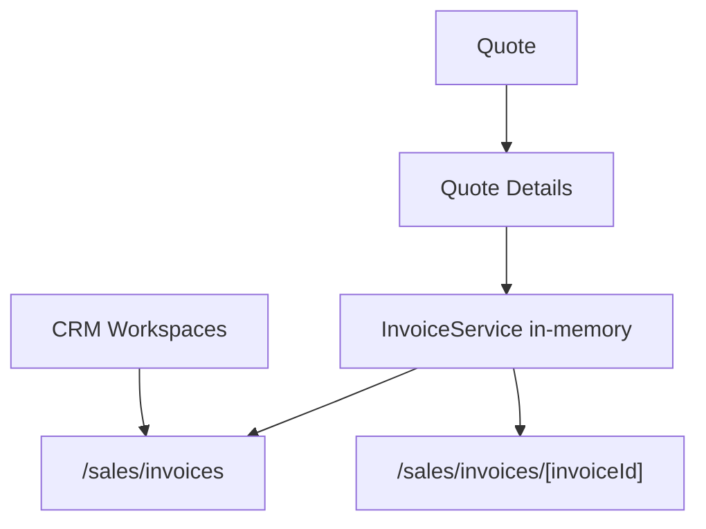

# SPR-322 — Quote → Invoice Workflow

## Summary

SPR-322 adds the first visible Quote → Invoice workflow. Accepted quotes can generate an invoice in one click, and invoices are now browsable through a dedicated Sales workspace.

## Objective

Allow users to transform an accepted quote into an invoice without backend, Prisma, API or runtime changes.

## Architecture

## Files Created

- `src/app/(erp)/sales/invoices/page.tsx`
- `src/app/(erp)/sales/invoices/[invoiceId]/page.tsx`
- `src/modules/sales/invoices/index.ts`
- `src/modules/sales/invoices/invoice.constants.ts`
- `src/modules/sales/invoices/invoice.service.ts`
- `src/modules/sales/invoices/invoice.store.ts`
- `src/modules/sales/invoices/invoice.types.ts`
- `src/modules/sales/invoices/invoice.utils.ts`
- `src/modules/sales/invoices/invoices.seed.ts`
- `src/modules/sales/invoices/ui/index.ts`
- `src/modules/sales/invoices/ui/invoice-details-workspace.tsx`
- `src/modules/sales/invoices/ui/invoice-panels.tsx`
- `src/modules/sales/invoices/ui/invoices-workspace.tsx`

## Files Modified

- `src/services/navigation/sidebar-adapter.ts`
- `src/modules/sales/index.ts`
- `src/modules/sales/quotes/ui/quote-details-workspace.tsx`
- `src/modules/crm/home/crm-home-page.tsx`
- `src/modules/crm/opportunities/ui/opportunities-workspace.tsx`
- `src/modules/crm/companies/ui/details/pages/company-details-page.tsx`
- `src/modules/crm/contacts/ui/details/components/contact-details-tabs.tsx`
- `src/modules/crm/contacts/ui/details/hooks/use-contact-details.ts`
- `src/modules/crm/contacts/ui/details/pages/contact-details-page.tsx`
- `docs/02_PROJECT_STATUS.md`

## Public APIs

- `InvoiceService`
- `invoiceService`
- `Invoice`
- `InvoiceStatus`
- `getInvoiceTotals()`
- `createInvoiceInputFromQuote()`
- `InvoicesWorkspace`
- `InvoiceDetailsWorkspace`
- `CompanyInvoicesPanel`
- `ContactInvoicesPanel`

## Validation

- `npm run validate:runtime`
- `npm run typecheck`
- `npm run build`

## Known Risks

- Invoices are stored in memory only.
- Invoice creation from quote is available for accepted quotes only.
- Payment lifecycle is present as status and totals, but real payments are not implemented.

## Future Work

- Add payment recording.
- Add invoice PDF generation from the Sales module.
- Add quote acceptance workflow controls.
- Add conversion from invoice to payment tracking.

## Release Notes

- Added `/sales/invoices`.
- Added `/sales/invoices/[invoiceId]`.
- Added one-click invoice generation from accepted quote details.
- Added Sales sidebar `Factures`.
- Added CRM Home recent invoices.
- Added company/contact invoice panels.
- Added pipeline invoice status indicators.
