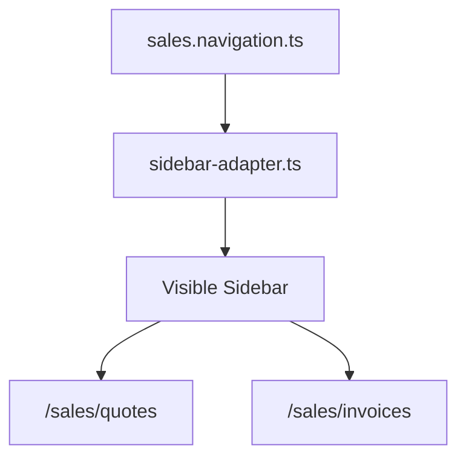

# SPR-322A — Sales Navigation Integration

## Summary

SPR-322A integrates Sales navigation into the visible application sidebar using an official Sales navigation source, matching the CRM navigation architecture.

## Objective

Expose `Ventes → Devis / Factures` in the Sidebar without hardcoded menu workarounds.

## Architecture

## Files Created

- `src/modules/sales/sales.capabilities.ts`
- `src/modules/sales/sales.constants.ts`
- `src/modules/sales/sales.manifest.ts`
- `src/modules/sales/sales.module.ts`
- `src/modules/sales/sales.navigation.ts`
- `src/modules/sales/sales.permissions.ts`
- `src/modules/sales/sales.routes.ts`
- `src/modules/sales/sales.types.ts`

## Files Modified

- `src/modules/sales/index.ts`
- `src/services/navigation/sidebar-adapter.ts`
- `docs/02_PROJECT_STATUS.md`

## Public APIs

- `salesNavigation`
- `salesRoutes`
- `salesManifest`
- `salesModule`
- `registerSalesModule()`

## Validation

- `npm run validate:runtime`
- `npm run typecheck`
- `npm run build`

## Known Risks

- Sales is still in-memory only.
- The legacy `/devis` and `/factures` pages still exist, but Sidebar now routes users to `/sales/quotes` and `/sales/invoices`.

## Future Work

- Register Sales module through the future module/plugin lifecycle.
- Extend Sales navigation with payments after SPR-323.

## Release Notes

- Added official Sales module navigation metadata.
- Sidebar now renders `Ventes → Devis / Factures`.
- Removed hardcoded Sales sidebar item construction from the adapter.
