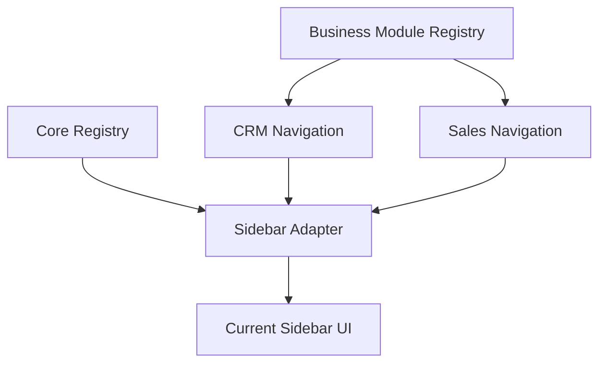

# SPR-322B — Sidebar Architecture Cleanup

## Summary

SPR-322B cleans the visible sidebar architecture so official business modules appear first and legacy navigation remains clearly separated.

## Objective

Make the sidebar reflect the official product structure without creating pages, recreating CRM or Sales, changing business logic, or modifying runtime behavior.

## Architecture

## Files Created

- `docs/sprints/SPR-322B.md`

## Files Modified

- `docs/02_PROJECT_STATUS.md`
- `src/modules/crm/crm.navigation.ts`
- `src/services/navigation/sidebar-adapter.ts`

## Public APIs

- No new public runtime API.
- `getSidebarGroups()` now composes:
  - registered business module groups for CRM and Ventes;
  - explicit legacy groups for Accueil, Stock, Finance, Équipe, Analyse, IA and Système.

## Validation

- `npm run validate:runtime`
- `npm run typecheck`
- `npm run build`

## Known Risks

- Legacy non-business sections still depend on the Core Registry definitions.
- CRM contextual entries intentionally point users to Company or Contact workspaces until standalone pages exist.

## Future Work

- Move remaining legacy modules into official business modules when their product domains are formalized.
- Add navigation validation coverage for registered business modules.

## Release Notes

- Sidebar now displays CRM and Ventes as clear top-level product sections.
- CRM includes the root CRM entry plus CRM child entries.
- Ventes includes Devis and Factures from the Sales module navigation.
- Legacy groups are separated below CRM and Ventes.
