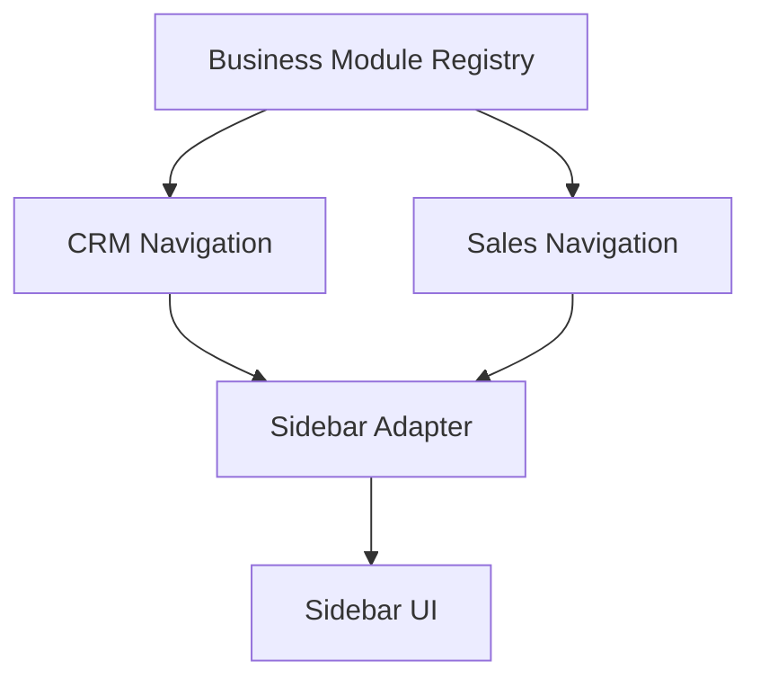

# SPR-322C — CRM & Sales Navigation UX Cleanup

## Summary

SPR-322C improves the CRM and Sales navigation hierarchy without changing routes, services, runtime behavior or business logic.

## Objective

Remove the visible `CRM / CRM` repetition and move the commercial pipeline into the Sales navigation where users naturally expect it.

## Architecture

## Files Created

- `docs/sprints/SPR-322C.md`

## Files Modified

- `docs/02_PROJECT_STATUS.md`
- `src/modules/crm/crm.navigation.ts`
- `src/modules/crm/home/crm-home-page.tsx`
- `src/modules/crm/opportunities/ui/opportunities-workspace.tsx`
- `src/modules/sales/sales.navigation.ts`
- `src/modules/sales/sales.types.ts`
- `src/services/navigation/sidebar-adapter.ts`

## Public APIs

- No business or runtime API was added.
- `SalesNavigationId` now includes `sales.pipeline` as a navigation-only entry.
- Sidebar navigation items can use `metadata.sidebarLabel` to avoid repeating a module group label as a root item label.

## Validation

- `npm run validate:runtime`
- `npm run typecheck`
- `npm run build`

## Known Risks

- The pipeline route remains `/crm/opportunities` for backward compatibility even though it is now presented under Ventes.
- Opportunity domain code still lives under CRM until a future Sales domain migration is explicitly planned.

## Future Work

- Decide whether opportunities should eventually move physically into `src/modules/sales/`.
- Add navigation snapshot validation for visible CRM and Ventes structures.

## Release Notes

- CRM home now appears as `Vue d'ensemble`.
- `Pipeline commercial` is now displayed under Ventes.
- Pipeline breadcrumb now reads `Ventes / Pipeline commercial`.
- CRM Home shortcuts use `Pipeline commercial` terminology.
