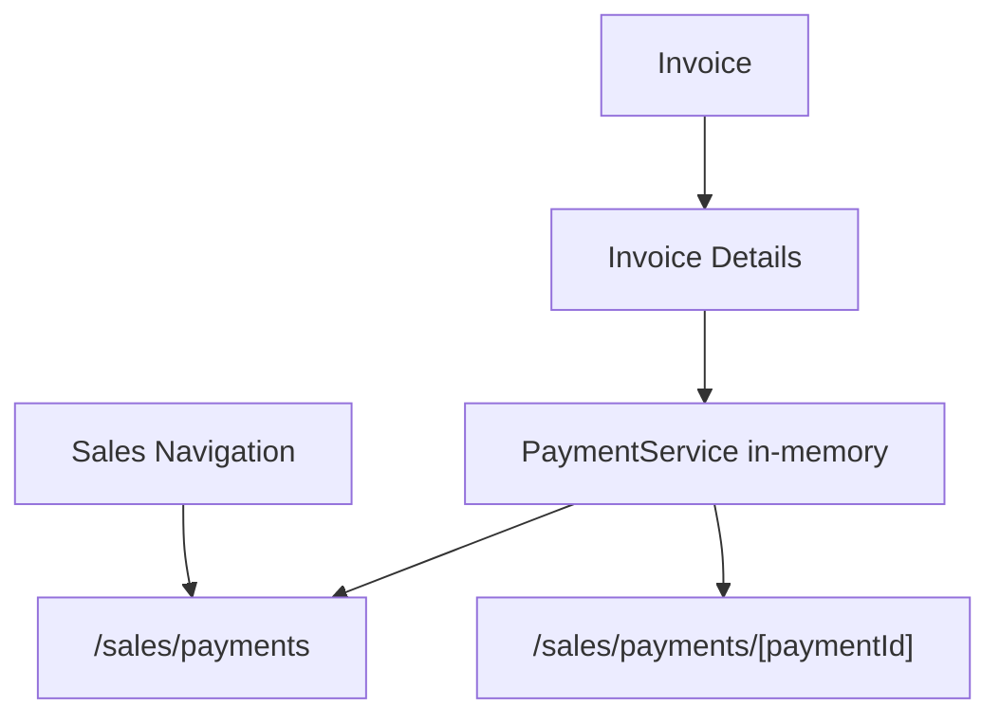

# SPR-323 — Payments Workflow Foundation

## Summary

SPR-323 adds the first Sales payment workflow foundation. Users can browse client payments, open payment details and register an in-memory payment from an invoice with a remaining balance.

## Objective

Allow invoices to move from issued or partially paid toward paid status through a lightweight payment record without backend, Prisma, API or runtime architecture changes.

## Architecture

## Files Created

- `src/app/(erp)/sales/payments/page.tsx`
- `src/app/(erp)/sales/payments/[paymentId]/page.tsx`
- `src/modules/sales/payments/index.ts`
- `src/modules/sales/payments/payment.constants.ts`
- `src/modules/sales/payments/payment.service.ts`
- `src/modules/sales/payments/payment.store.ts`
- `src/modules/sales/payments/payment.types.ts`
- `src/modules/sales/payments/payment.utils.ts`
- `src/modules/sales/payments/payments.seed.ts`
- `src/modules/sales/payments/ui/index.ts`
- `src/modules/sales/payments/ui/payment-details-workspace.tsx`
- `src/modules/sales/payments/ui/payments-workspace.tsx`
- `docs/sprints/SPR-323.md`

## Files Modified

- `docs/02_PROJECT_STATUS.md`
- `src/modules/sales/index.ts`
- `src/modules/sales/invoices/ui/invoice-details-workspace.tsx`
- `src/modules/sales/sales.capabilities.ts`
- `src/modules/sales/sales.navigation.ts`
- `src/modules/sales/sales.permissions.ts`
- `src/modules/sales/sales.routes.ts`
- `src/modules/sales/sales.types.ts`

## Public APIs

- `PaymentService`
- `paymentService`
- `Payment`
- `PaymentStatus`
- `PaymentMethod`
- `createPaymentInputFromInvoice()`
- `PaymentsWorkspace`
- `PaymentDetailsWorkspace`

## Validation

- `npm run validate:runtime`
- `npm run typecheck`
- `npm run build`

## Known Risks

- Payments are stored in memory only.
- Payment recording is a demo workflow and does not persist across reloads.
- Payment reconciliation is represented as status metadata only; no accounting or bank reconciliation engine exists yet.

## Future Work

- Add persisted payment records and invoice/payment referential integrity.
- Add invoice PDF generation from the Sales module.
- Connect payment events to Activity, Audit and Notification runtimes when business services start emitting platform events.

## Release Notes

- Added `/sales/payments`.
- Added `/sales/payments/[paymentId]`.
- Added Sales sidebar `Paiements`.
- Added in-memory payment recording from invoice details.
- Added linked payments inside invoice details.
