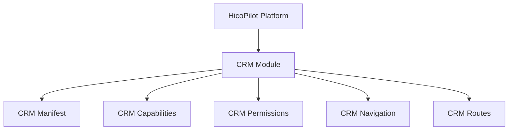

# CRM Module Foundation

## Purpose

The CRM module is the first official HicoPilot Business Suite application. It provides the platform-facing skeleton for future CRM features such as customers, companies, contacts, activities and notes.

This foundation does not implement CRM business logic, CRUD pages, APIs, persistence or UI.

## Architecture

## Platform Integration

- Manifest: `crm.manifest.ts`
- Capabilities: `crm.capabilities.ts`
- Permissions: `crm.permissions.ts`
- Navigation: `crm.navigation.ts`
- Routes: `crm.routes.ts`
- Module registration: `crm.module.ts`

## Manifest

The CRM manifest follows the HicoPilot Manifest System and describes module identity, version, capabilities, permissions, compatibility and future entry metadata.

## Permissions

The module exposes permission definitions only. Permission enforcement remains owned by the existing platform Permission Runtime.

## Capabilities

Initial capabilities:

- `crm.read`
- `crm.write`
- `crm.customer.read`
- `crm.customer.write`
- `crm.company.read`
- `crm.company.write`
- `crm.contact.read`
- `crm.contact.write`
- `crm.activity.read`
- `crm.activity.write`
- `crm.note.read`
- `crm.note.write`

## Navigation

Top-level navigation:

- CRM

Prepared child placeholders:

- Customers
- Companies
- Contacts
- Activities
- Notes

## Future Roadmap

Future CRM sprints should add:

- Company foundation
- Contact foundation
- CRM activity timeline
- Notes
- CRM services
- CRM persistence
- CRM UI pages

## Customer Domain Foundation

The Customer domain foundation lives in `src/modules/crm/customers/`.

It provides:

- strong TypeScript customer models
- in-memory `CustomerService`
- validation helpers
- filtering, sorting and search utilities
- workspace-aware operations
- permission-aware operation inputs

It does not add UI, Prisma, APIs or visible routes.
