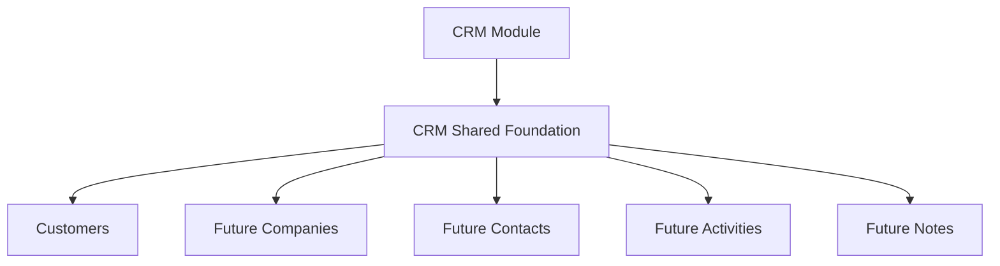

# CRM Shared Foundation

## Purpose

The CRM shared foundation centralizes reusable CRM infrastructure for future CRM entities such as Customers, Companies, Contacts, Activities and Notes.

This layer does not own business-specific behavior. It provides generic contracts and pure helpers that domain modules can consume.

## Architecture

## Shared Layer Philosophy

- Keep reusable behavior in `shared`.
- Keep entity-specific rules inside each domain.
- Keep UI out of CRM shared infrastructure.
- Keep persistence out of CRM shared infrastructure.
- Prefer typed contracts over implicit object shapes.

## Contents

- `crm-search.ts`: free-text and multi-field search helpers.
- `crm-filters.ts`: generic workspace, status, owner, tag, archived and date filters.
- `crm-sorting.ts`: stable multi-field sorting.
- `crm-pagination.ts`: page and cursor-ready pagination contracts.
- `crm-errors.ts`: typed CRM error contracts.
- `crm-events.ts`: CRM event name contracts only.
- `crm-commands.ts`: CRM command DTOs only.
- `crm-utils.ts`: normalization, labels, timestamps, safe ids and equality helpers.

## Relationship With Customer Domain

The Customer domain remains the owner of customer-specific validation and service behavior. Future customer UI can consume both `customers` and `shared` without placing business logic in React components.

## Future Consumers

Future CRM domains should reuse this layer before introducing their own helper functions:

- Companies
- Contacts
- Activities
- Notes
- CRM import/export
- CRM UI tables
- CRM search panels

